# DataSpider Servista 新人向け利用マニュアル

西友 DSS（DataSpider Servista）の入門テキストです。2024 年三日間の「ツール活用トレーニング」録画を整理し、現行の開発手順につなげています。

**Web 版（転送向け、操作画面付き）：** [DataSpider新人利用マニュアル.html](DataSpider新人利用マニュアル.html)

**中文版：** [DataSpider新人使用手册.md](DataSpider新人使用手册.md) / [DataSpider新人使用手册.html](DataSpider新人使用手册.html)

画面はセゾン教材 Day1 / Day3 PDF から切り出しています。[images/](images/) にあります。

| 項目 | 内容 |
|---|---|
| 製品 | DataSpider Servista 4.4 (x64) AP3、SP `A00050` |
| 開発画面 | Studio for Web（西友は Web が主。Desktop Studio は使わない） |
| 録画 | Day1（2024-11-22、約 1:58）操作と 3 つのデモ；Day2（2024-11-28、約 1:57）フレームワーク + SQL Server；Day3（2024-12-05、約 1:45）テストとリリース |
| 講師 | セゾン / 延吉 |
| 付属資料 | 『DataSpiderツール活用トレーニング』Day1 / Day3 PDF、開発ガイドライン v3.2、『DSS開発の流れ』、リリース手順書 v1.0 |

**パスワード・ホスト認証情報は本マニュアルに書きません。** ログインが必要なときは『DSS開発の流れ』またはガイドライン P.103 / P.115–118 を自分で開いてください。スクリプト、チャット、Git に転記しないこと。

---

## 0. このマニュアルの使い方

推奨順：

```
第 1 章 概念を掴む       → Day1 前半（ログイン、Designer、2 本の線）
第 2 章 3 つのデモ        → Day1 後半（CSV / 0 件 / ファイルトリガー）
第 3 章 西友フレームワーク → Day2（教材との差が最も大きい）
第 4 章 テスト            → Day3 前半
第 5 章 リリース          → Day3 後半 + リリース手順書
第 6 章 本番 IF           → 台帳で採番して本番まで（日常作業はここ。DEMO で止めない）
第 6.5 節 命名規則       → ガイドライン P.12 の全表。プロジェクト作成前に照合する
```

研修用プロジェクトは `SAMPLE_PROJECT`、作業ディレクトリは `/data/DSSROOT/DEMO/`（Windows では `F:\DSSROOT\DEMO\`）。**本番 IF に DEMO パスは使わない。** `/seiyuroot/<IF_ID>/` を使う。

詰まったら：コンポーネントを選んで **F1**（ヘルプに例外と制限あり）→ HULFT FAQ → [セゾン技術サポート](https://www.hulft.com/tech-support)。製品名は DataSpider Servista 4.4 (x64) AP3、SP `A00050`。シリアル番号はガイドライン P.122 のみ。Git に転記しない。

日常の開発順は『DSS開発の流れ』（2026-05-12 / 07-22）を正とし、細部はガイドラインの該当頁：

| 調べること | ガイドライン | 開発の流れ |
|---|---|---|
| フレームワーク / 戻り値 / マスタ | P.22–31、P.50–56 | 「西友フレームワーク」 |
| `if_master` の列と登録 SQL | P.27、P.115–118 | 「if_master登録」 |
| トリガー / 命名 | P.12、P.31、P.112–114 | 「トリガー作成」 |
| プロジェクト zip / サービス登録 / 共有 | P.105–111 | 「デプロイ」 |
| ユーザ / グローバルリソース / Azure / SFTP | P.32–35、P.58–63 | — |
| 3 環境 URL、アカウント、GCS コンソール | P.105 | 2 ページ目 |
| 技術サポート | P.122–123 | — |

---

## 1. 製品の概念（Day1）

DataSpider は GUI の EAI です。Studio でスクリプトを描き、Server 上で Java にコンパイルして実行します。能力は 4 つです。

| 構成 | 役割 |
|---|---|
| Adapter | CSV、Excel、DB、FTP、REST、固定長などの読み書き |
| Mapper / Converter | 項目変換、フィルタ、日付、結合（論理アイコン約 140） |
| Studio | 開発、運用、ログ確認 |
| Trigger | 定時、ファイル着地、JP1 などで自動起動 |

西友のデータ連携で DSS はシステム間 EAI/ETL（ファイル / DB）であり、分析基盤ではない。選定はガイドライン P.18：

| 方式 | 主な用途 | 使うとき |
|---|---|---|
| DataHub | ファイル連携、高 Tier、冗長 | 基幹、Tier の高い連携 |
| **DataSpider** | システム間のファイル / DB 連携 | 中低 Tier、ファイルまたは DB |
| Databricks | 蓄積、分析、帳票 | 分析データ。書き込みは ADLS（MS0007） |
| Lakehouse Federation | 外部の最新状態を参照するだけ | リアルタイム在庫・売上など。参照元 DB の負荷に配慮 |

ファイル連携（SFTP / Blob）は疎結合、大容量向き、リアルタイム性は低い。DB 連携（JDBC）は速く ACID があるが、ソース構造に縛られる。高品質なトランザクションで保管が要るときは、DataSpider 用 ADLS（IF ごとに 1 コンテナ、外部は SFTP、約 30 日で自動削除）を推奨する。

データ品質（ガイドライン P.2）：文字コード、全角半角、電話番号のハイフンを先に決める。欠損・重複・異常値は早く検知する。文字化けはデータ破損として扱い、黙って書き込まない。

### 1.1 3 つの言葉を混ぜない

| 語 | 意味 |
|---|---|
| **スクリプト** | Designer で描くソース |
| **プロジェクト** | 関連スクリプトのまとまり。ダウンロード、アップロード、サービス登録はプロジェクト単位 |
| **サービス** | プロジェクトを Server に登録したあと、トリガー・他スクリプト・ScriptRunner から呼べる |

開発リポジトリと実行リポジトリは別です。「サービスとして登録」したプロジェクトだけがトリガーに掛けられます。**スクリプトを直したら、必ずサービスを再登録する。**

### 1.2 Studio でよく使う画面

- **Designer**：スクリプトと Mapper を描く
- **Control Panel**：ユーザ、タスク、グローバルリソース、マウント
- **Explorer**：DataSpider の論理ファイルシステム（スクリプトに書くのはここ。`C:\` ではない）
- **My Service / My Trigger / My Log**：登録済みサービス、トリガー、実行ログ

緑の三角 = 通常実行（速い、ログは少ない）。虫アイコン = デバッグ実行（ステップ実行でき、ログが厚い）。

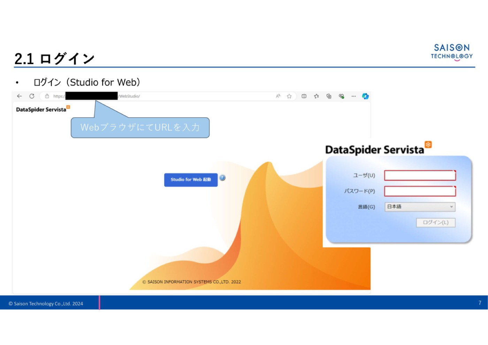

ブラウザで WebStudio の URL を開いてログインします。西友本番のアドレスは第 7 章。教材のサンプルホストは使わない。

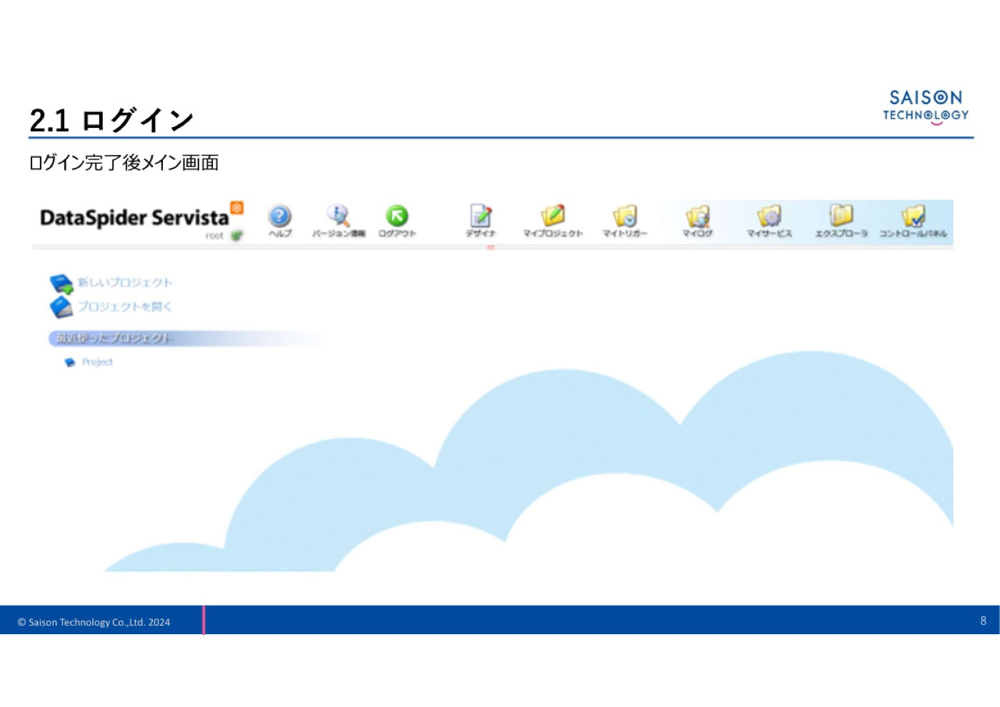

ログイン後、上段は デザイナ / マイプロジェクト / マイトリガー / マイログ / マイサービス / エクスプローラ / コントロールパネル。

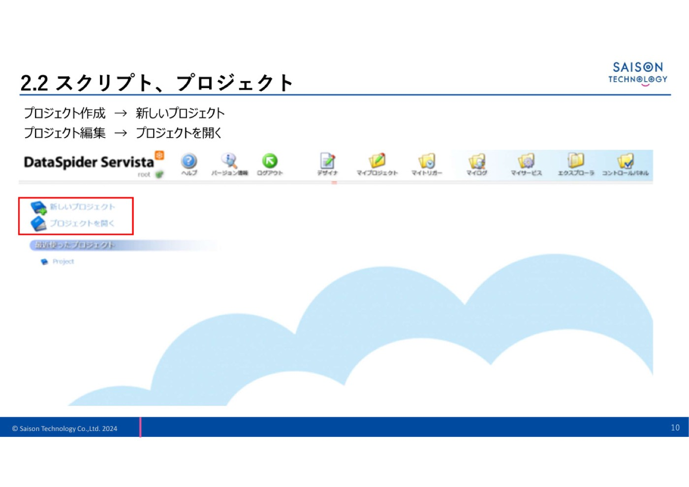

「新しいプロジェクト」で新規、「プロジェクトを開く」で既存を開く。研修は `SAMPLE_PROJECT`。本番 IF のプロジェクト名は台帳の IF ID。

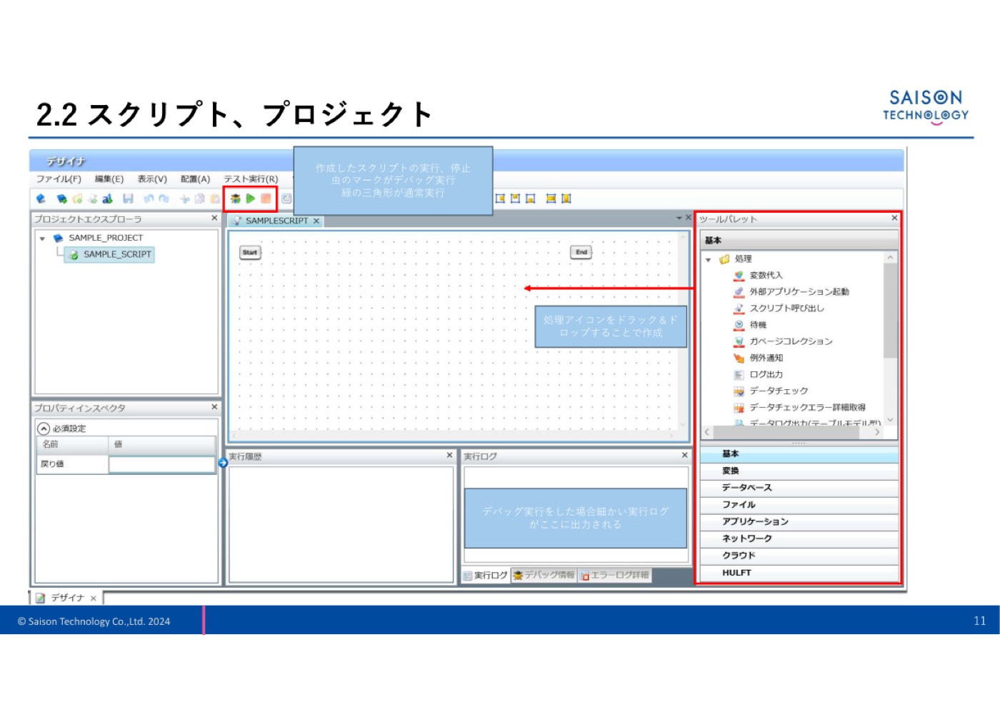

緑三角 = 通常実行、虫 = デバッグ実行。右側のツールボックスからアイコンをキャンバスへ。プロセスフローは必ず Start → End まで手でつなぐ。デバッグログは画面下に出る。

### 1.3 2 本の線

| 線 | 見た目 | 規則 |
|---|---|---|
| データフロー | オレンジの破線 | 入力を指定すると自動で出る。一対多可 |
| プロセスフロー | 黒い実線 | **必ず手で** Start → … → End。1 アイコンから出るプロセス線は 1 本だけ |

End までつながっていないスクリプトは、完結した処理として扱えない。

### 1.4 バージョン、共有、マウント

- 保存のたびにバージョンが残る。復元できる。バージョン比較レポートも出せる。
- 権限がなければ他人のプロジェクトは見えない。共有：マイプロジェクト → 右クリック → プロパティ → 共有。
- 一般ユーザが見られるトリガーは、自分が「トリガー所有者」のものだけ。
- OS ディレクトリは先に DataSpider ファイルシステムへマウントする（例：`C:\Document\Sample` → `/data/mount`）。スクリプトをドライブ文字に縛らない。

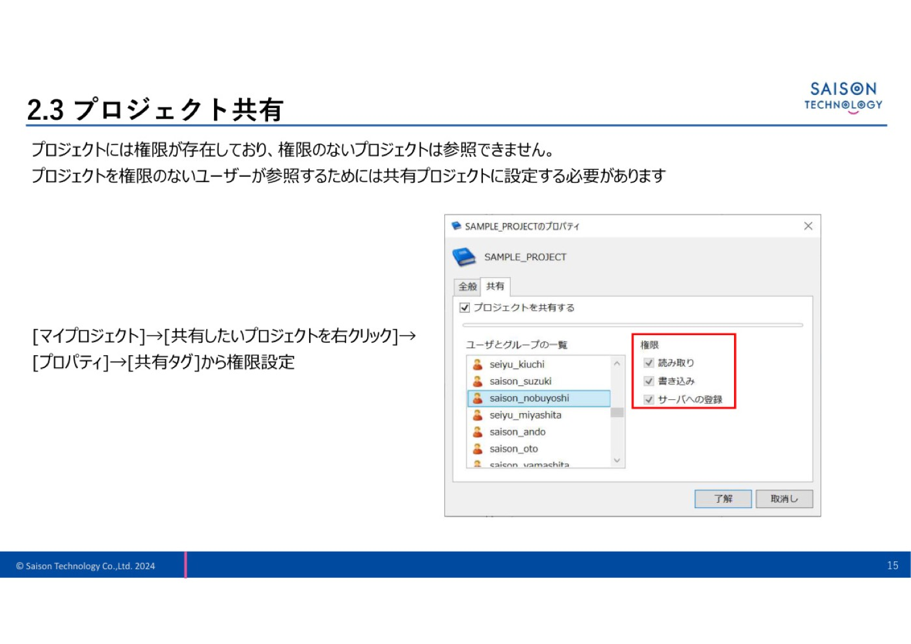

マイプロジェクト → 右クリック → プロパティ → 共有。権限がなければ他人のプロジェクトは見えない。

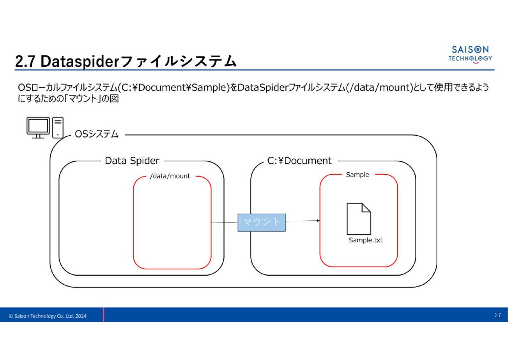

OS の `C:\Document\Sample` を `/data/mount` に掛ける。スクリプトには DataSpider パスだけ書く。

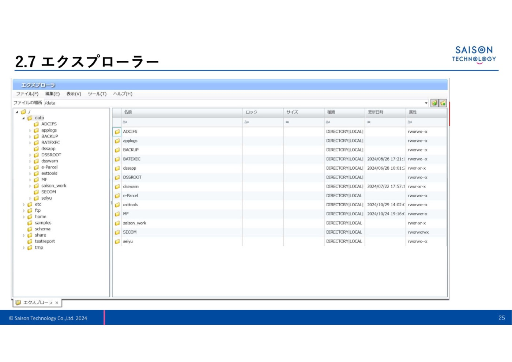

エクスプローラ：論理ファイルシステムのディレクトリとファイルを管理する。

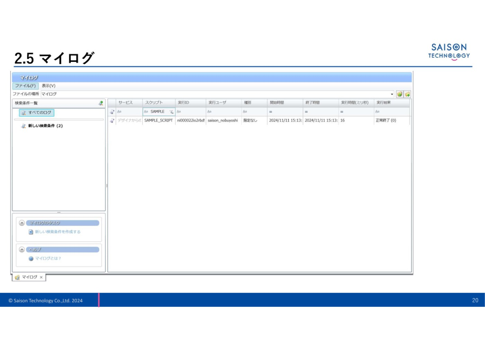

マイログ：条件を付けてスクリプト実行結果を見る。DEBUG が Designer で切れたときはここで全文を見る。

### 1.5 本環境で確認済みのアダプタ（Day1 導入有無）

| 状態 | アダプタ |
|---|---|
| 購入済 ● | Salesforce、Microsoft Azure、SQL Server（選択式）、固定長、FTP、REST |
| 標準 〇 | JDBC、CSV、Excel、XML、HTML、ファイル操作、Mail、Thunderbus、HULFT |

表に ●/〇 がないもの（Oracle、GCP、Box、SAP など）は**使えると思い込まない**。先に現行環境を確認する。HTML 読み取りは Web Adapter。可変長は可変長アダプタ。

CSV 読み取り：文字コード **Windows-31J**。1 行目をヘッダにする（データ値にしない）。

---

## 2. Day1 の 3 つのデモ（先にスクリプトを描けること）

到達目標：CSV を読む、Mapper を使う、ファイルを書く、サービス登録する、ファイルトリガーを掛ける。

### デモ① CSV 変換集計

- 入力：`OrderList.csv`（受注日、支店、ケース数、入り数、容量、商品名、受注_ID）
- 動き：支店別に発注数を集計し、`OrderList_total.csv` を出す
- 要点：項目変換は **Mapper**。IF / ループで行単位に加工しない

### デモ② 0 件をエラーにする

- 入力：ヘッダだけでデータ行がない `OrderList.csv`
- 動き：出力ファイルを書かず、自らエラー終了する（フレームワーク接続後は警告または 255）

### デモ③ ファイルトリガー

- `OrderList.csv` を入力フォルダへ置く → ①のスクリプトが自動実行 → 結果が出力フォルダへ
- 要点：トリガーが掛けるのは**登録済みサービス**。Designer 上の未登録スクリプトではない

サービス登録：プロジェクトを右クリック →「プロジェクトをサービスとして登録」。画面で元プロジェクトと対象サービスのスクリプトを比較し、確認してから登録する。

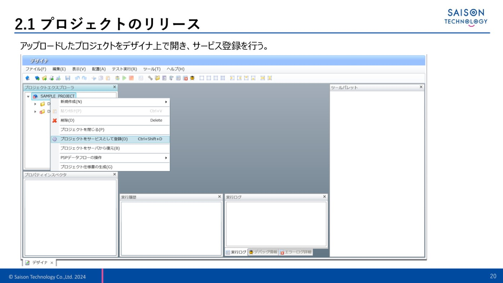

スクリプトを直したら必ずやり直す。しないとトリガーは古い版を動かし続ける。

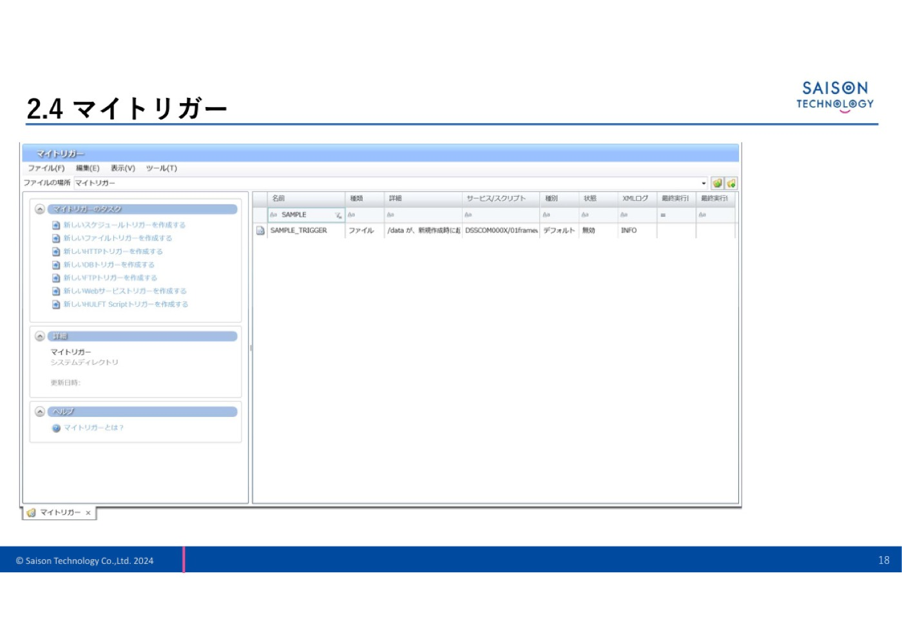

教材例はファイルトリガー。西友の本番 IF は `SEIYUCOM000X` / `01frameworkBatch` を呼ぶ。

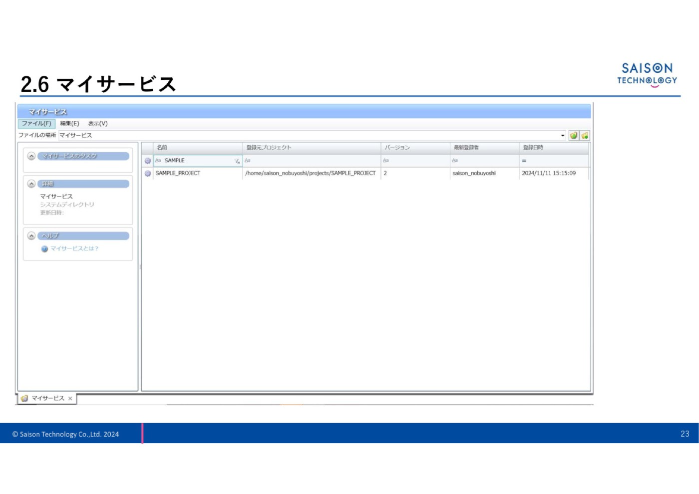

マイサービス：サービス名 = プロジェクト名、状態が利用可能であること。

---

## 3. 西友フレームワーク（Day2。本番開発は必ずこれ）

教材では Designer からスクリプトを直接実行できる。西友の本番 IF は**そうではない**。トリガーは常に共通フレームワークを呼び、フレームワークが個別プロジェクトを呼ぶ。

### 3.1 誰が何をするか

```
スケジュールトリガー / JP1 / ScriptRunner
        ↓
SEIYUCOM000X / 01frameworkBatch     ← 使うだけ。改修しない
        ↓
SEIYUCOM001X
  01getInterfaceInfo   if_master、param_master を読む
  個別プロジェクトを呼ぶ（あなたの IF）
  02outputLog / 03sendMail
        ↓
個別プロジェクト = インターフェース ID。業務だけ書く
```

| プロジェクト | 役割 | 改修してよいか |
|---|---|---|
| `SEIYUCOM000X` | 入口 `01frameworkBatch` | 使うだけ。改修しない |
| `SEIYUCOM001X` | マスタ読込、個別スクリプト呼出、ログ、メール | **改修禁止** |
| `SEIYUCOM002X` | ADLS パス分割 | 利用可 |
| `SEIYUCOM003X` | バックアップ掃除（毎日 0 時） | 知っておけばよい |
| HOUSEKEEP | ローカルバックアップ掃除 | **非推奨**。バックアップは Blob `AZURE_STR_DSS` |
| インターフェース ID プロジェクト | 個別処理 | ここに業務を書く |

個別スクリプトは**運用メールを自分で送らない、フレームワークログを自分で書かない**。メールは `03sendMail` が送る。送信元は台帳を正とする。よくあるのは `no-reply-HR-EAI@seiyu.com` または `no-reply-Seiyu-EAI@seiyu.com`。

JP1 / ScriptRunner：共通テンプレート `C:\Temp\scriptrunner.xml`。第 1 引数に `if_id`。ログは My Log に入り、トリガー起動と同じ。

### 3.2 4 つの出口（Day2 の核心）

フレームワークは先に `if_master` を読み、開始ログを書き、あなたのスクリプトを呼び、終了状態で 4 路に分ける。

**戻り値は End コンポーネントのプロパティインスペクタに置く。** スクリプト属性に適当な数字を書いてはいけない。

| 分岐 | あなたのスクリプトの終わり方 | フレームワークの動き |
|---|---|---|
| 1 正常 | End 戻り値 **0** | 成功ログを書いて終了 |
| 2 警告 | 戻り値 **1–254**（デモ：CSV がヘッダのみ / 0 件） | 警告メール + 警告ログ |
| 3 制御可能な例外 | 戻り値 **255**、かつ `out_*` を埋めた | 異常メール + 異常ログ |
| 4 キャッチ漏れ | Exception / catch なし | フレームワークが catch して異常メール。戻り値は実際 **-1** |

警告・異常は「警告変数設定」「異常変数設定」で catch 内容を入れる：

- `out_component_name` / `out_component_type`
- `out_message_category` / `out_message_code` / `out_message_level`
- `out_error_type` / `out_error_message`

メール後半はこの項目になる。例：

```
FILE0001E|java.io.FileNotFoundException|/data/DSSROOT/DEMO/INPUT/OrderList.csv|CSV読取
```

Day2 の読み替え：

- 正常 = 最後まで走った、戻り値 0
- 警告 = 0 件、戻り値 1–254
- 異常 = 読みまたは書き失敗、戻り値 255 + `out_*`

### 3.3 if_master / param_master

DB：`DSSSEIYU`。表を直す前にリリース手順書 3.1 どおり **バックアップ**する。リリースでは同じ `if_id` を DELETE してから INSERT することが多い（ガイドライン P.117）。

列名は表の正式名を使う。`from` / `to` と略さない：

| 列 | 意味 |
|---|---|
| `if_id` | インターフェース ID = プロジェクト名 |
| `if_name` | 表示名（スクリプトファイル名ではない） |
| `service_name` | 個別プロジェクト登録後のサービス名（通常はプロジェクト名） |
| `script_name` | 個別スクリプト名。例 `01OutputData` |
| `from_mail_address` | 結果通知 From |
| `to_mail_address` | 結果通知 To。**必ず** `isd_support_desk@seiyu.com` を含める |
| `cc_mail_address` / `bcc_mail_address` | 空でも可 |
| `mail_title_header` | 件名ヘッダ。よくインターフェース ID |
| `tier` | 重要度 |

```sql
USE [DSSSEIYU]
GO
IF EXISTS (SELECT 1 FROM [dbo].[if_master] WHERE [if_id] = N'<IF_ID>')
BEGIN
  DELETE FROM [dbo].[if_master] WHERE [if_id] = N'<IF_ID>';
END;
GO
INSERT [dbo].[if_master] (
  [if_id], [if_name], [service_name], [script_name],
  [from_mail_address], [to_mail_address], [cc_mail_address], [bcc_mail_address],
  [mail_title_header], [tier]
) VALUES (
  N'<IF_ID>', N'<表示名>', N'<IF_ID>', N'01xxxx',
  N'no-reply-Seiyu-EAI@seiyu.com',
  N'isd_support_desk@seiyu.com;<業務宛先>',
  NULL, NULL, N'<IF_ID>', NULL
);
```

DEV：`DHUB-DB-DEV` ポート 1433、DB `DSSSEIYU`。DBeaver 可。アカウントはガイドライン P.103（**パスワードはマニュアルにもスクリプトにも書かない**）。STG / PROD：必ず RDP + SSMS。Server 名は `SeiyuServerStg.seiyu.com` / `SeiyuServerPro.seiyu.com`。アカウントは Data チームに確認する。

`param_master`：`IF_ID` + `param_no` + `param_value`。`01getInterfaceInfo` が読んで `param1`–`param20` に置く。パスやファイル名など環境差は、できるだけこれらのパラメータにする。アイコン属性に直書きしない。

### 3.4 トリガーの掛け方（3 環境とも同じ）

| 項目 | 値 |
|---|---|
| サービス | `SEIYUCOM000X` |
| スクリプト | `01frameworkBatch` |
| 変数 `if_id` | 当該 IF ID |
| 実行ユーザ | `exec_SY` |
| 状態 | 登録後は「待機中」であること |

トリガーを**個別スクリプトに直接掛けない。** 画面はガイドライン P.112–114：マイトリガー → 種類（よく使うのはスケジュール / ファイル）→ サービス `SEIYUCOM000X`、スクリプト `01frameworkBatch`、変数 `if_id` → 有効化後の一覧は「待機中」。実行ユーザは必ず `exec_SY`（パスワードは本頁に書かない）。

### 3.5 SQL Server（Day2 後半）

アダプタでできること：テーブル読取/書込、検索 SQL、更新 SQL、ストアド、ローダ。接続例 `COM_SQLServer2022`。更新 SQL は `?{列名}` でプレースホルダ。

演習 DB：`DHUB-DB-DEV` / `DSSROOT`（`if_master`、`param_master`、`DEMO_OrderList`）。

**DBデモ1**（CSV をテーブルへ。トランザクション付き）：

```
Transaction → DELETE → csv_read → mapping → テーブル書き込み → COMMIT
```

`process_date` は「現在日時」。コンポーネントの「データ処理方式」は「スクリプトの設定を使用する」を選べる。大件数はメモリに載せ切らない。「大容量データ処理」を付ける。

既定ではアイコンごとにコミットする。複数ステップを一括成功 / 一括ロールバックするときは、トランザクションアイコンかスクリプトのトランザクション属性を使う。

---

## 4. テスト（Day3）

条件分岐のそれぞれに期待結果を置く（録画の ①②③）。主経路だけ通して終わりにしない。

| 手段 | 使い方 |
|---|---|
| 通常実行 | 緑三角。速い。詳細ログは少ない |
| デバッグ実行 | 虫。実行履歴とログがあり、ステップで見られる |
| ブレークポイント | アイコン右クリック「ブレークポイントを設定/解除」。止まってからデバッグを続ける |
| テスト引数 | スクリプト右クリック → プロパティ → テスト実行。入力変数にテスト値を入れる |
| デバッグ情報 | 実行中のスクリプト変数を見る |
| エラーログ | メッセージコードで Help を検索する |

DEBUG ログは Designer で切れることがある。全文は **My Log**。本番ログは **INFO**。DEBUG / FINEST は付けない。

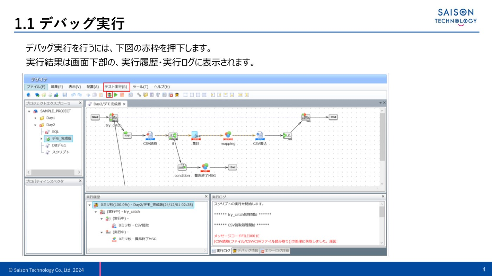

虫をクリックしてデバッグ実行。下の「実行履歴 / 実行ログ」にステップ結果が出る。この画面は CSV 読取失敗。メッセージコード FILE0001E。

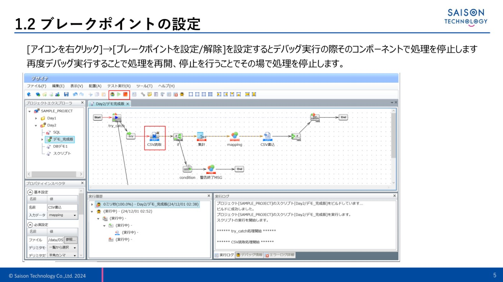

アイコン右クリック → ブレークポイントを設定/解除。デバッグはそのコンポーネントで止まる。虫で再開する。

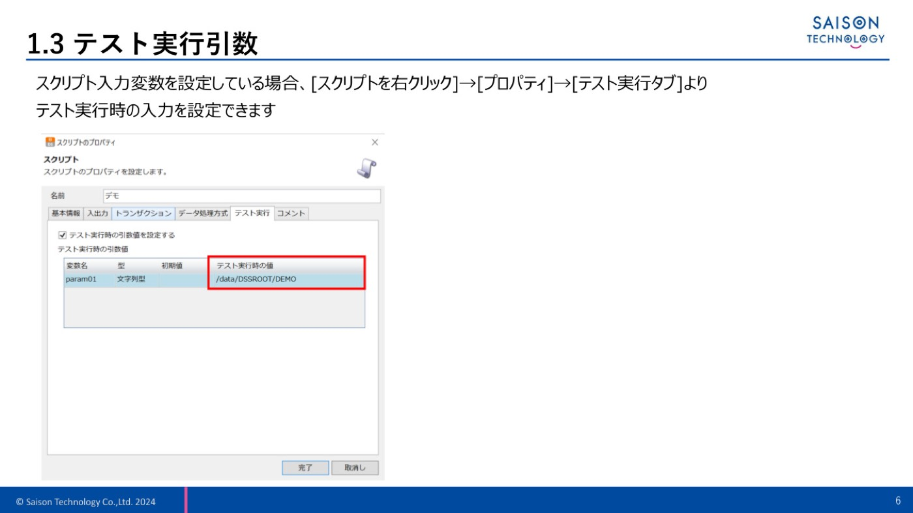

スクリプト右クリック → プロパティ → テスト実行。入力変数にテスト値を入れる。アイコン属性を直さなくてよい。

---

## 5. リリース（Day3 + リリース手順書 v1.0）

**リソース管理者**で**移行先環境**の WebStudio にログインする。順：プロジェクト → 非プロジェクト資材 → システム表。

STG / PROD は SDP 変更。監視は約 1 週間前に ITSM へ。

### 5.1 プロジェクト（zip ダウンロード / アップロード）

1. マイプロジェクト → 右クリック → ローカルへダウンロード。「バージョンを指定してダウンロード」を付け、**数字が最大の最新版**を選ぶ。
2. 移行先：ファイル → ローカルからアップロード。
   - 上書きアップロード = 既存プロジェクトの最新バージョンとしてコミット
   - 別プロジェクト名でアップロード = 新しいプロジェクト
3. プロジェクトを開く → **サービス登録**（サービス名 = プロジェクト名）→ マイサービスで確認。
4. zip は**共有権限を持たない**。STG / PROD アップロード後：マイプロジェクト → 右クリック → 共有 → **SY グループに読み取り**。一覧に「共有」と出ること。
5. スクリプトが Explorer フォルダを書くなら、実行ユーザ（`exec_SY` など）に書き込みグループを付ける（ガイドライン P.110）。

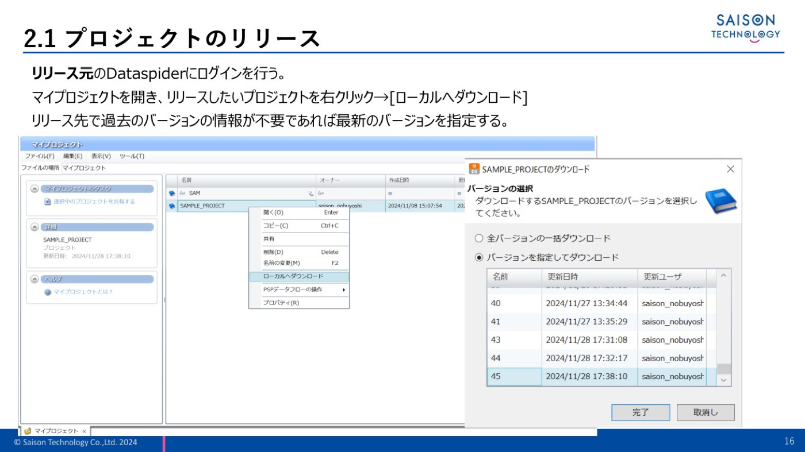

右クリック → ローカルへダウンロード。「バージョンを指定してダウンロード」を選び、数字が最大の最新版を取る（図では 45）。

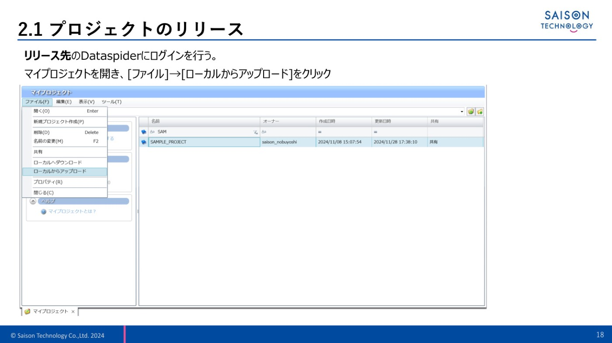

移行先：ファイル → ローカルからアップロード。今ダウンロードした zip を選ぶ。

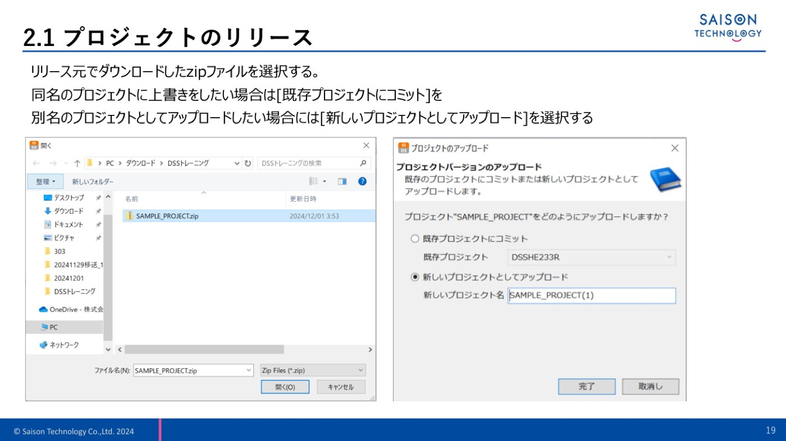

同名の上書きは「既存プロジェクトにコミット」。別名なら「新しいプロジェクトとしてアップロード」。


アップロードしたプロジェクトを開く → プロジェクトをサービスとして登録。サービス名はプロジェクトと同名にする。

### 5.2 非プロジェクト（トリガー、グローバルリソース、環境変数など）

1. コントロールパネル → DataSpiderServerの設定 → サーバ移行。
2. エクスポート：先に「全て解除」し、今回運ぶものだけチェック。エクスポート結果にエラーがないことを確認する。
3. インポート：**外さない**「プロジェクトの差分インポート」と「環境変数の差分更新」。外すと全表上書きになり、移行先の既存内容が消える。
4. インポート後、Windows サービス **DataSpiderServista** を再起動する。
5. 同名のとき：サービス / トリガー / グローバルリソースなどは**上書き**。環境変数とプロジェクトファイルは**スキップできる**。グローバルユーザロジックは同名でも中身が違うと自動で `name_1` になる。

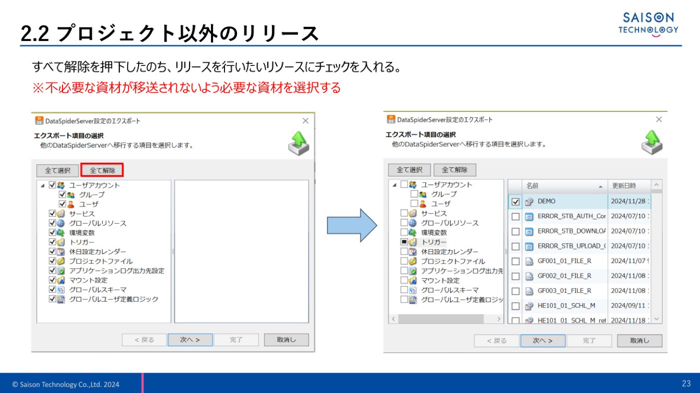

エクスポート：先に「全て解除」し、今回運ぶ資材だけチェックする。丸ごと全選択しない。

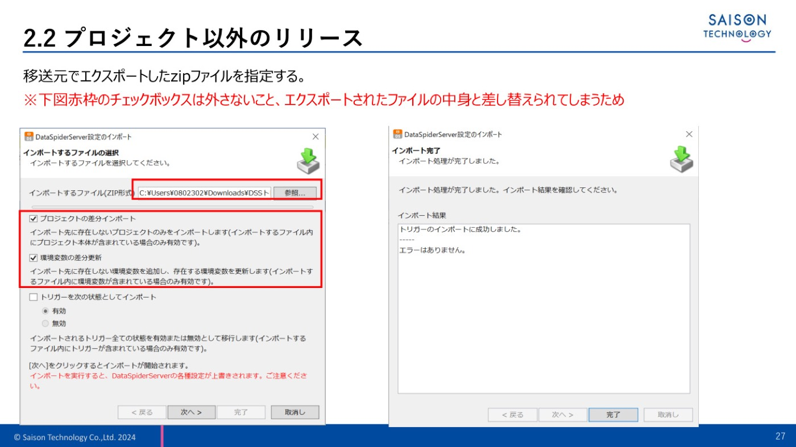

インポート時、赤枠の 2 つは**外さない**。「プロジェクトの差分インポート」「環境変数の差分更新」。外すと全表上書きになる。

### 5.3 システム表（if_master など）

プロジェクトだけでは足りない。フレームワーク表は SQL Server を別に直す。直す前に必ずバックアップする。

| 方法 | 手順 |
|---|---|
| CSV バックアップ | 新しいクエリ → 対象表を SELECT → 結果を右クリック「結果に名前を付けて保存」 |
| スクリプトバックアップ | タスク → スクリプトの生成 → 対象表 → 詳細設定で「スキーマとデータ」→ sql で保存 |
| 追加 | 上位200行の編集 → 最終行 `*` → 貼付または手入力 → SQL で確認 |
| 修正 / 削除 | 先にクエリデザイナで WHERE して行を絞り、直すか消す。最後に SQL で確認 |

---

## 6. 本番 IF の作り方（日常はこの章）

研修は DEMO。本番は台帳の IF ID。1 IF = 1 処理単位（同一 IF で複数ファイル可）。ガイドラインの区分は 単体 / バラマキ / 数珠繋ぎ / 複数で、**西友は単体のみ**。**数珠つなぎ禁止。** Designer から本番スクリプトを直接呼んで結合テストしない。

申請とリリース（ガイドライン P.4–6）：AppG が IF 申請 → DataG が受付・事前レビュー・IF ID 連絡 → 開発・テスト → リリースは SDP。監視は約 1 週間前に ITSM。台帳には初回登録日、PRO 登録日、ITSM 運用開始日、稼働開始日を書く。監視に必要な情報：起動時刻、L3（Owner チームと連絡先）、重要度/影響。変更・停止も事前に DataG へ。

Owner：Requester から依頼を受けたあと、**連携元側の Owner** が IF の取りまとめとスクリプト開発を行い、データ内容にも責任を持つ。関連する IF の一群は、**起点 IF の Owner** がまとめる。

申請の種類：インターフェース申請、IntakeForm（Databricks 連携）、DSS 設定申請、グローバルリソース申請、アカウント申請、その他個別相談。共通・共有リソースは Data チームが維持する。専用権限 G や Access Token が要るときは先に Data チームと相談する。

設計書：シーケンス図 + 詳細マッピング定義書（ガイドライン P.10–11）。Designer で描き始める前にこの 2 つを用意する。

### 6.1 採番

`SEIYU-TRIALインターフェース管理台帳.xlsx` の `DSSインターフェース台帳` から IF ID を取る（西友側で管理。『DSS開発の流れ』の第 1 歩）。

形式：`FROM6_TO6_SEQ3`（大文字 + アンダースコア）。例 `AM0002_MS0007_001`。システム 6 桁はシステム一覧のシステム ID。プロジェクト名 = インターフェース ID。

### 6.2 DEV → STG → PROD（開発の流れ 8 ステップ）

同じ手順を 3 環境で繰り返す。既存の個別プロジェクトを複製して直す。空からフレームワーク呼出を書き直さない。

| 歩 | すること | 必須ルール |
|---|---|---|
| 1 | IF ID | 台帳で採番済み |
| 2 | プロジェクト作成 | プロジェクト名 = インターフェース ID |
| 3 | スクリプト | 既存スクリプトをコピーして直す。`01` + キャメル英語またはローマ字。例 `01updDelDate`。個別処理だけ書く |
| 4 | Explorer | 作業ディレクトリ `/seiyuroot/<IF_ID>/` を作り、グループにアクセス権を付ける |
| 5 | サービス登録 | サービス名 = プロジェクト名。スクリプト変更後は必ず再登録 |
| 6 | トリガー | `SEIYUCOM000X` / `01frameworkBatch` だけ。パラメータ `if_id`、ユーザ `exec_SY` |
| 7 | `if_master` | `to_mail_address` にサポートデスク。表を直す前にバックアップ。頁：P.115–118 |
| 8 | テスト後に昇格 | STG/PROD は SDP。画面：P.105–111 |

リソースメールは `mls_ISDDataPlatform@seiyu.com`。ユーザ申請は **所属 Director を CC**。DEV のグローバルリソースは自分で作ってよいが、参照権限を正しく付ける。STG/PROD は Data チームが申請書ベースで箱を作る。SFTP は**鍵認証のみ**。

ユーザ申請の件名：`【Dataspider】ユーザー作成依頼`。本文：申請区分（新規/変更）、環境（開発/検証/本番）、氏名、メール、社員番号。

グローバルリソース申請の件名：`【Dataspider】グローバルリソース作成依頼`。本文：DSS ユーザ ID、新規/変更、環境、欲しい接続（SFTP / Azure など）と理由。管理者から追加ヒアリングがある。

Azure ストレージ：Databricks とは **SFTP**。それ以外は **Azure ストレージコネクタ**。件名 `【Dataspider】Azureストレージ接続設定依頼`。

SFTP 鍵は接続先から担当者が受け取り、DSS 管理者へ渡す。サーバ上のパス：`/data/SSH/<Intake番号>/xxxxx.ppk`。フォルダは発行元で一意（Intake / ServerName+UserName）。グローバルリソースにはこのパスだけ書く。鍵ファイルを Git に置かない。

### 6.3 個別スクリプトの既定スケルトン

正式な見本は 2026-05-13 実演の `CM0010_IF0079_006` / `01OutputData`（Oracle 抽出 → ローカル CSV/END → GCS）。別の骨格を発明しない：

```
try/catch
  → 作業領域 /* を delete                 # /seiyuroot/<IF_ID>/
  → ソース抽出（検索系 SQL / CSV / SFTP …）
  → Mapper（日付、項目、フィルタ）
  → 業務ファイル + 完了ファイルを書く（例 ORDER_${file_date}.END）
  → 引き渡し（GCS / ADLS / SFTP）
  → End 戻り値 0
catch → 異常変数設定 → End 255
```

GCS 接続名 `GCP_STR_DSS`、バケット `ods-seiyu-{dev|stg|prod}`。コンソール：

- https://console.cloud.google.com/storage/browser/ods-seiyu-dev
- https://console.cloud.google.com/storage/browser/ods-seiyu-stg
- https://console.cloud.google.com/storage/browser/ods-seiyu-prod

パスはよく `/<IF_ID>/${folder_date}/`、または台帳で決めた `deliveryData/YYYYMMDD`。フォルダがなければ作り、あれば上書き。

ADLS（ガイドライン P.13）：IF ごとに 1 コンテナ。コンテナ名はインターフェース ID を小文字ハイフン。外部システムはそのコンテナへ SFTP。ファイルは約 30 日で自動削除。高 Tier のトランザクション連携では推奨。

バックアップは原則 Blob。グローバルリソース名 `AZURE_STR_DSS`。`/data/backup` はオプション。コンテナは DEV なら開発者が作れる。STG/PROD はプラットフォームチームへ。Azure アダプタでは先に「コンテナ名一覧の更新」を実行する。しないと一覧が空になる。

### 6.4 読 / 変換 / 書 の選び方

| 場面 | 使うもの | 注意 |
|---|---|---|
| DB 全表抽出 | テーブル読み取り | グローバルリソースは再利用可 |
| 条件付き抽出 / 複雑な SQL | 検索系 SQL 実行 | ウィザード生成後に SQL を手直しすると、ウィザードは再編集できない |
| 項目変換、フィルタ、日付、結合 | Mapper | 先に出力 schema を決める。CSV はヘッダファイルが使える |
| ファイル JOIN | Merge（APPEND / INTEGRATE / Left-Right JOIN） | DB 側は SQL JOIN を優先 |
| 大量書込 / マスタ洗い替え | テーブル書き込み + バッチ処理 | 「キー一致行は更新」= upsert。86 万件ではバッチが通常 upsert より約 30 倍速い |
| 複雑な更新 / 外部結合 | 更新系 SQL 実行 | 超大件数には向かない |
| 固定長 EDI | 固定長アダプタ + ウィザード | Group / Record / Field。定義はグローバルリソースへ |

複数スクリプトで同じ構造を使うときは **グローバルスキーマ**（テーブルモデル）。PSP Mapper 用なら XML 型に変えない。PSP 非対応コンポーネントでは、グローバルスキーマを付けても並列にならない。

リトライ：接続エラーやタイムアウトの回数・間隔を決める（ガイドライン P.14）。通知は重要度（クリティカル / 警告）で分ける。メールはフレームワークが送る。個別スクリプトで別系統を作らない。通信は SSL/TLS。パスワードと API Key は環境変数または外部設定。アイコンに直書きしない。

### 6.5 命名規則（ガイドライン P.12。この表を写す）

識別子は**英語またはヘボン式ローマ字**のみ。中文・日本語を名前にしない。表記：アッパー = すべて大文字；スネーク = アンダースコア；キャメル = 先頭小文字のキャメル；アッパーキャメル = 先頭大文字のキャメル。

| 対象 | 表記 | 規則 | 例 |
|---|---|---|---|
| インターフェース ID | アッパースネーク | `FROMシステム(6桁)_TOシステム(6桁)_連番(3桁)`。システム 6 桁はシステム一覧のシステム ID | `AM0002_MS0007_001` |
| プロジェクト名 | インターフェース ID と同じ | 完全一致 | `AM0002_MS0007_001` |
| スクリプト名 | 2 桁連番 + キャメル | ① 同一プロジェクト内の連番 ② 処理概要：英語またはヘボン式 | `01updDelDate` |
| 定数 | アッパースネーク | 英語またはヘボン式 | `FILE_NAME` |
| 変数 | スネーク（小文字） | 英語またはヘボン式 | `file_name` |
| パラメータ | スネーク + 型接頭辞 | 入力 `in_`、出力 `_out`、入出力 `io_`。残りは英語 | `in_file_name` |
| 環境変数 | `ENV_` + アッパースネーク | 英語 | `ENV_RETRY_COUNT` |
| 作業ファイル名 | スネーク（小文字） | スクリプト内の通常ファイルは英語小文字アンダースコア | `file_name` |
| テーブル名 | 接頭辞 + アッパースネーク | マスタ `M_`、トランザクション `T_` | `M_FILE_SEND` |
| ADLS コンテナ / フォルダ | 小文字 + ハイフン | ADLS 制約：小文字・数字・`-` のみ。インターフェース ID をこの形にする | `am0002-ms0007-001` |
| 固定長 / 可変長フォーマット名 | アッパーキャメル | `FIX` または `VAR` + `READ` または `WRITE` + フォーマット名称（英語またはヘボン式） | `FIX_READ_Time` |
| グローバルリソース（固定長定義） | 同上 + システム | フォーマット名 + `_` + システム ID + 名前 + `_01` | `FIX_READ_MS0007_Test_01` |
| グローバルリソース（それ以外） | プロトコル_システム6桁[_ユーザまたは Intake] | 下表。Datalake なら Intake 番号。必要なら枝番（例：DB 名） | `SFTP_AM0002_ユーザID` |
| トリガー | インターフェース ID + 種類 | スケジュールが複数なら：インターフェース ID + `SCHL_` + 3 桁連番 | `AM0002_MS0007_001_SCHL` |

**グローバルリソースのプロトコル接頭辞**

| 接頭辞 | 用途 | 例 |
|---|---|---|
| `SQL` | SQL Server | `SQL_DSS_SEIYU_DB`（DSS 専用） |
| `ORCL` | Oracle | `ORCL_CM0010_wknpsuser` |
| `JDBC` | JDBC（Databricks 読み / MS0005 を含む） | `JDBC_AM0002_ユーザID` |
| `ODBC` | ODBC | `ODBC_AM0002_ユーザID` |
| `FTP` / `SFTP` | ファイル転送。SFTP は**鍵のみ** | `SFTP_AM0002_ユーザID`、`SFTP_MS0007_<Intake>` |
| `REST` | REST | `REST_AM0002_ユーザID` |
| `MAIL` | メール | `MAIL_AM0002_ユーザID` |
| `BLOB` | Azure Blob | `AZURE_STR_DSS` |

同一ソースシステムでも「グローバルリソース + ユーザ ID」を分ける。全 IF で 1 接続を共用しない。枝番は末尾に付けてよい（例：DB 名）。Databricks への書きは ADLS（MS0007）。Databricks からの読みは JDBC（MS0005）。**接続プールは付けない。**

**トリガーの種類**

| 識別子 | 種類 | 西友の本番 IF |
|---|---|---|
| `SCHL` | スケジュール | 常用。`SEIYUCOM000X` / `01frameworkBatch` に掛ける |
| `FILE` | ファイル | 研修デモ用。本番でもフレームワークに掛け、個別スクリプトには掛けない |
| `HULF` | HULFT | 台帳どおり |
| `HTTP` | HTTP | 台帳どおり |
| `WSDL` | WEB サービス | 台帳どおり |

パスも名前に合わせる：作業領域 `/seiyuroot/<IF_ID>/`；SFTP 鍵 `/data/SSH/<Intake>/xxxxx.ppk`；GCS バケット `ods-seiyu-{dev\|stg\|prod}`、ディレクトリはよく `/<IF_ID>/${folder_date}/`。

---

## 7. 3 環境（2026）

日常は独立した 3 つの WebStudio を使う。2024 設計書の「Staging に開発機を置く」は使わない。

| | DEV | STG | PROD |
|---|---|---|---|
| WebStudio | `https://dhub-dss-dev.seiyu.com:8443/WebStudio/` | `https://dhub-dss-stg.seiyu.com:8443/WebStudio/` | `https://dhub-dss-pro.seiyu.com:8443/WebStudio/` |
| アカウント | 個人アカウント | `exec_SY` | `exec_SY` |
| サーバ IP | `10.22.214.244` | `10.22.214.164` | `10.22.212.164` |
| DB | `DHUB-DB-DEV` / `DSSSEIYU`。DBeaver 可 | `DHUB-DB-STG`。必ず RDP + SSMS | `DHUB-DB-PRO`。必ず RDP + SSMS |
| GCS バケット | `ods-seiyu-dev` | `ods-seiyu-stg` | `ods-seiyu-prod` |

現状は単機。障害は即停止。不定期 14:30–16:00 にメンテナンス。高 Tier、メンテ窓で止められない処理は DSS に置かない。メンテ予告は Teams「データ利活用ポータル | Dataspider事務局からのお知らせ」。西日本 DR は DataSpider 切替に**使わない**。

西友は **Studio for Web** が主。Desktop Studio はテストプロジェクトを作れるが、Web が 3 環境あるので日常は使わない。ローカル Studio は応答が悪く、Modules 初回同期に 4 時間以上かかることがある。開発画面にしない。

---

## 8. 禁止事項（リリース前に照合）

DSS 全体を落とす：

- IF / ループで行単位のデータ加工（Mapper に入れる）
- 1 スクリプトのアイコンが約 100 を超える
- 大件数で「大容量データ処理」を付けない（Java OOM になり、インスタンス全体に影響しうる）
- PSP と大容量を同時に付けると **PSP が優先**され、大容量は走らない（読み取り後に Mapper 経由で PSP 非対応の書き込みへ行くときは、Mapper と書き込みの間では大容量が働く）

PSP（スマートコンパイラは既定で有効）：約 1000 件ずつ、読/変換/書をマルチスレッド。塊サイズは変更不可。Designer の「表示」で「PSPデータフローの表示/非表示」を付けると見える。大容量：スクリプト右クリック → プロパティ → データ処理方式 → 「大容量データ処理を行う」。最低限だけメモリ、残りはディスク。全メモリより遅い。

やってはいけないこと：

- `SEIYUCOM000X` / `SEIYUCOM001X` を改修する
- スクリプトにパスワード、API Key を直書きする
- 数珠つなぎ / バラマキ / 複数 IF を 1 本に串刺し。Designer から本番スクリプトを呼ぶ
- Databricks グローバルリソースで接続プールを付ける
- SQL Express をデータベースファイルシステムにする（上限 10GB）
- SFTP のパスワード認証（鍵のみ）
- 本番ログを DEBUG / FINEST にする（Designer ツール → オプション。DEBUG は CPU とログサイズが膨らむ）
- 研修で失敗したマウント `/data/Shared_test` を新規スクリプトに書く

性能の目安：PSP はおよそ 1000 件を一塊に並列。テーブル書き込みのバッチは 86 万件検証で通常 upsert の約 30 倍。1 億件級は DSS で担がない（検証では `server\tmp` が 10GB 超、CPU 満載。Postgres なら `psql` / `COPY` を検討）。

止まったら：マイログで実行中か確認 → コントロールパネル **タスクマネージャ** → スクリプトプロセスを選んでプロセスの終了。消えなければサービス `DataSpiderServista` を再起動。CLI の session 切断はガイドライン P.89–90。新人は画面から。

---

## 9. 新人向け演習チェックリスト

録画を見ながら自分で付ける：

**Day1**

- [ ] DEV WebStudio にログインし、Designer / Explorer / My Log を見つけられる
- [ ] スクリプト、プロジェクト、サービスを区別できる
- [ ] オレンジのデータフローと黒いプロセスフローを区別し、End まで手でつなげる
- [ ] CSV は Windows-31J、ヘッダを飛ばし、Mapper で支店集計ができる
- [ ] プロジェクトをサービス登録してからファイルトリガーを掛ける

**Day2**

- [ ] トリガーがなぜ `SEIYUCOM000X` を呼ばねばならないか説明できる
- [ ] End に 0 / 1–254 / 255 を置け、catch で `out_*` を埋められる
- [ ] `if_master` で `if_id` / `service_name` / `script_name` / `to_mail_address` を対応付けられ、TO にサポートデスクが必須だと知っている
- [ ] Transaction 付きの CSV→テーブル書込を見た

**Day3 + 本番 IF**

- [ ] デバッグ + ブレークポイントで正常 / 0 件 / 読取失敗の 3 本を期待結果まで走らせられる
- [ ] 手順書どおり最新バージョン指定でダウンロードし、アップロード後にサービス再登録できる
- [ ] zip が共有を持たないこと、STG/PROD では SY グループに読み取りを付けること、インポートで差分オプションを外さないこと、`if_master` 変更前にバックアップすることを知っている
- [ ] 第 6.5 節どおり IF ID からプロジェクト名、スクリプト名、トリガー名、ADLS コンテナ名、グローバルリソース接頭辞を書ける
- [ ] 第 6 章どおりスケルトンを列挙でき、単体のみ・Owner は連携元側だと説明できる

---

## 10. 付録：見本 IF（見てから自分のを描く）

2026-05-13 田村実演：`CM0010_IF0079_006` / `01OutputData`。

- FROM：CM0010 若菜 新店舗。TO：IF0079 TRIAL ストレージ
- Oracle：`ORCL_CM0010_wknpsuser`、schema `WKNPSUSER`、例 `WKNST_DAILYORDER`
- 作業領域：`/seiyuroot/CM0010_IF0079_006/`
- 順：try/catch → delete `/*` → 検索 SQL → Mapper で `file_date` / `folder_date` → csv_write → `ORDER_${file_date}.END` → `gcs_put` 先 `ods-seiyu-dev/<IF_ID>/${folder_date}/`

項目の詳細は同ディレクトリ skill の `examples.md`。可視化チートシート：`.cursor/canvases/DSS-开发速查.canvas.tsx`。

---

## 11. 出典

- DataSpider ワークショップ Day1/2/3 会議録画（2024-11/12）
- DataSpiderツール活用トレーニング Day1、Day3 PDF
- 開発ガイドライン v3.2（2024-12-09、DataエンジニアリングG。本版は 123 頁から申請、命名、マスタ列名、リリース、PSP を補った）
- 『DSS開発の流れ』（2026-05-12 / 2026-07-22、4 頁。日常の DEV→STG→PROD 順と URL はこの資料を正とする）
- リリース手順書 v1.0（HR-EAI、2024-11-14）
- 2026-05-13 Teams 実演（CM0010_IF0079_006）

2026-07-22 Teams「DSSについて」は約 3GB、字幕なし。逐語起こしはできていない。環境 URL は『DSS開発の流れ』を正とする。
