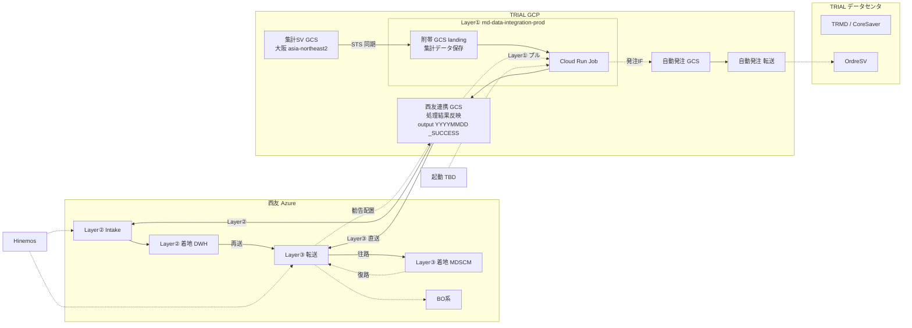

# SCM 統一 IF クラウド機アーキテクチャ（日本語版）

基準日: 2026-09-15（方針更新 2026-09-22：PJ ID 暫定 `md-data-integration-prod`、**landing＝本PJ附帯GCS／output＝西友連携GCS**、源データ隔離・単方向納品、起動 TBD）  
対象: 西友 MD 基幹統合 / 自動補充 Sinops 系 第2段階  
位置づけ: 詳細設計の Job 前提。DSS スクリプトそのものではない。

出典:

- `【概算見積もり】西友MD基幹統合_外部IF開発見積_BO系・自動補充Sinops系_20260903.xlsx`
- 既存 DSS: 西友 Azure 上の DataSpider。GCS 連携用プロジェクト例 `seiyu-trial-data-exchange`
- `sources/20260915-データ連携経路-データ活用連携_小峰資料_松尾加筆.md`
- `sources/20260922-gcp環境設計/`（**本 PJ 申請図**。集計SV GCS（大阪）→本PJ附帯GCS（landing）→Cloud Run→西友連携 GCS（output））
- `sources/20260922-current-architecture-flow/`（**申請構成クリーン版**。源データ隔離・最終 TXT のみ Seiyu 交付・権限／費用前提）
- `sources/20260922-gcp-spec-estimate/`（**GCP Pricing Calculator 見積** `SPEC.xlsx`。2026-09-22。月約 ¥18,190）
- `sources/20260922-scm-if-cloud-application/`（**申請用 PPT（日）** `SCM連携クラウド機_GCP環境申請.pptx`。構成＋スペック＋費用）
- 構成図（draw.io）: `SCM-IFクラウド機アーキテクチャ.drawio`（日）／`SCM-统一IF机架构.drawio`（中）※2026-09-22 再作成

---

## 1. 結論

申請する **IF クラウド機** は TRIAL GCP の **1 Project** である。  
**GCP プロジェクト ID（暫定 2026-09-22）: `md-data-integration-prod`。**  
資料上の旧称 **ProjectD / Seiyu_Order** は説明用エイリアス（この暫定 ID を指す）。中身は図の **外部IF** だけ（集計系データの取得・変換・**西友連携 GCS への配置**。復路は同 GCS からプルして変換し、**自動発注 GCS へプッシュ**）。

**GCP 環境申請図（2026-09-22 CONFIRMED）:**  
- `sources/20260922-gcp環境設計/gcp環境設計.pptx`（12:51）  
- `sources/20260922-current-architecture-flow/current-architecture-flow-ja-clean.pptx`（クリーン版・隔離／権限／費用）  

流れは **集計SV GCS（大阪 asia-northeast2）→ Storage Transfer → 本PJ附帯GCS（landing／`source-landing/`）→ Cloud Run Job（SMART）→ 西友連携 GCS（output／`result/`・最終 TXT のみ）**。

- **Layer① は一体:** 新規申請環境 **`md-data-integration-prod`** ＝ **附帯 GCS（landing）＋ Cloud Run**。どちらも Layer①。
- **landing ＝ 本 PJ（`md-data-integration-prod`）附帯 GCS（東京）＝ PPT「自有 GCS」。** 大阪から同期した **集計系データ（TBL/MAT/DM/TANA 等）の保存先**。パス例 `source-landing/YYYYMMDD/`。**源データ 7日保管。**
- **output ＝ 西友連携 GCS（東京）＝ PPT「Seiyu 専用 GCS」。** Layer① の外。会社間の正本・唯一通路。パス例 `result/YYYYMMDD/final.txt`、完了印 `_SUCCESS`。西友 DataSpider はここを読む／書く。
- **安全境界（CONFIRMED）:** **源データは西友連携 GCS に入らない。** Seiyu 側権限は **objectCreator のみ**。結果を自有 GCS に重複保存しない。単方向納品（最終 TXT のみ）。
- **処理流れ:** Layer① 内で集計を附帯 GCS に保存し Cloud Run で SMART 処理したあと、**最終 TXT のみ西友連携 GCS（output）へ upload**。output 後の二次プッシュは置かない。
- **本機（VM／永続ディスク）にステージングを持たない。** 永続は GCS のみ。大容量はストリーム + resumable upload；必要時のみ ephemeral disk 外排。処理中の一時作業領域（/tmp 等）は可。**新規 GKE は作らない。**
- **Cloud Run Job スペック（申請図）:** 4 vCPU / 16 GiB（流式処理の初期値）。東京リージョン内で分割処理。大阪側入力は `_READY` + manifest。
- **権限（申請図）:** STS＝大阪 read→自有 write；Job＝自有 objectViewer→Seiyu objectCreator；Scheduler＝Workflows invoker のみ。
- **容量前提（申請図入力値）:** 自有 GCS 源データ約 251.6 GiB（7日）；大阪→東京転送約 1,078.4 GiB/月。
- **費用試算（Calculator `SPEC.xlsx` 2026-09-22）:** 月額合計約 **¥18,190**（議論用・非拘束）。内訳概算 — Cloud Run Jobs CPU ¥1,239 ＋ Memory ¥551、Standard Storage Tokyo（300）¥1,100、**Inter-region Asia 転送（1200）¥15,300**。大半は大阪→東京転送。Scheduler／Workflows／STS 等は本シート未計上。詳細は `sources/20260922-gcp-spec-estimate/転記.md`。
- **GCS 上のファイル名は必ず末尾 `_YYYYMMDDhhmmss`。** 形式 `{論理ベース}_{YYYYMMDDhhmmss}.{拡張子}`。日付ディレクトリ `YYYYMMDD`（landing/output）と両立。本PJ附帯GCS・西友連携 GCS・自動発注 GCS とも同じ。
- **自動発注 GCS** は TRIAL 内既存（復路の発注IF着地）。西友連携 GCS とは別用途。
- **本PJ附帯 GCS** の桶は `md-data-integration-prod` 配下。**西友連携 GCS** の正式桶名（例 `seiyu-trial-data-exchange` / `ods-seiyu-*`）は別契約・要突合（TBD）。
- **DataSpider** は **西友 Azure**。② Intake と ③ 転送。**全フィールド通過。型変換・選別・編集は Layer①（`md-data-integration-prod` の Cloud Run）。**
- **起動方式:** 申請構成図上は **Cloud Scheduler + Workflows**（READY→STS→Job→検証）。Hinemos との役割分担（特に DSS②③）は **TBD**。DSS②③は当面 Hinemos。
- IF クラウド機を課題ごとに別 Project にすると、SCM 統一連携面が割れる。

第2段階の Sinops 見積は **403 人日**（詳細設計 136 + 開発 144 + 単体 123）。共通基盤 **43 人日** はハブ立上げであり、403 に按分しない。BO 系 53.5 人日のプログラムは本段階の対象外だが、**同一の `md-data-integration-prod` + 西友 DataSpider は使う**。

---

## 2. 構成図

凡例:

- **Layer①** `md-data-integration-prod` 一体（**附帯 GCS ＋ Cloud Run**）。集計保存→変換→西友連携 GCS へ結果反映。297 人日
- **本PJ附帯 GCS** ＝ Layer① 内の集計保存先（landing）。西友連携 GCS ではない
- **西友連携 GCS** ＝ Layer① 外。処理結果の反映先（output）。会社間の唯一通路
- **Layer②／③** 西友 Azure DataSpider。西友連携 GCS を Intake／転送
- **自動発注 GCS** は復路専用。連携用 GCS ではない
- **起動** Layer① は TBD。②③は当面 Hinemos

直結しないもの:

- 集計 SV / CoreSaver / 統合マスタ / 自動発注 → Sinops
- Sinops → Shinise
- Sinops → OrdreSV / CoreSaver
- 西友 DataSpider → OrdreSV（TRIAL と西友の唯一の交互通路は **西友連携 GCS（output）**）

---

## 3. TRIAL 側の関係

| コンポーネント | 意味 | IF クラウド機への渡し方 |
|---|---|---|
| CoreSaver | TRIAL **基幹データ**。発注勧告の同期先 | 往路：TRMD→集計SV。クラウド機は集計SVから抽出。復路：OrdreSV 自動確定後に同期で戻る |
| OrdreSV | **基幹の発注サーバ群**。TRIAL 自動発注サーバそのものではない | 復路着地。西友 DSS からは受け取らない。TRIAL 自動発注の転送機能経由で自動確定する |
| 統合マスタ | **基幹の一部**（西友×TRIAL 統合後のマスタ IF） | 商品・店舗商品・カテゴリ・仕入先等（01–05、16–17）。TRIAL 枠の外ではない |
| 集計 SV | 基幹から出力する **各種共用データ**。出力先 GCS が **大阪（asia-northeast2）** の桶 | クラウド機は **集計SV GCS** を STS で同期して取り込む。第二の基幹ではない |
| 自動発注 | 同じ基幹を使う TRIAL 側機能。**自動発注 GCS + 転送**を持つ | 往路：仕入先休日等（18）。復路：IF クラウド機が勧告を自動発注 GCS へ置き、既存の転送機能が OrdreSV へ渡す |
| Shinise | TRIAL の **新基幹** | 発注勧告の着地ではない。便区分等は Shinise 側前提のまま |

棚割と倉庫（Hitluster）は **SEIYU 側の源ではない**。一覽の転送方向に従う。

- マスタ / 売上 / 在庫 / 棚割：**TRIAL→西友**、接続先は自動補充
- 棚割の接続元は **棚割→集計SV→外部IF→GCS**
- 倉庫系も **集計SV→外部IF→GCS**
- 発注勧告：**西友→TRIAL**。会社間は連携用 GCS のみ。着地は自動発注転送経由の基幹 OrdreSV

---

## 4. 双方向経路

### 往路（Sinops 向け）

1. **集計SV GCS（大阪）** に集計データ（TBL/MAT/DM/TANA 等）の `_READY` が出たら、Storage Transfer で **本PJ附帯 GCS（landing）**（日付 `YYYYMMDD`）へ同期する（①・申請図）
2. 東京 **Cloud Run Job**（`md-data-integration-prod`）が landing を読み、共通化・型変換し、**西友連携 GCS の output** に書く（①）。完了印 `_SUCCESS`
3. **西友連携 GCS（output）** が会社間の正本。output 後に別桶へ載せ替える二次プッシュはしない
4. 必要なマスタのみ DSS が DWH へ Intake（②）
5. DSS が西友連携 GCS（output 等）上のファイルを Sinops へ転送（③）

※ 往路の入力元は **集計SV GCS（大阪）**。直抽出ではなく STS 同期。正経路は **集計SV GCS → 本PJ附帯GCS（landing）→ Cloud Run → 西友連携 GCS（output）**。

### 復路（発注勧告 R：Layer③ と Layer①）

TRIAL と西友の **唯一の交互通路は西友連携 GCS（output）**。西友 DSS は OrdreSV へ直送しない。

発注勧告 R の層分担:

- **Layer③** Sinops → DSS 処理 → **西友連携 GCS**（当日／翌日以降。物理名 `_YYYYMMDDhhmmss`）
- **Layer①** 同 GCS → Cloud Run で処理 → **TRIAL 自動発注 GCS** へアップロード。**24/25 は共通 1 ジョブ**

手順:

1. Layer③：DataSpider が勧告を **西友連携 GCS** へ出す
2. Layer①：Cloud Run が同 GCS から当日と昨日の翌日以降をプルする
3. Layer①：採用判定（STEP20）
4. Layer①：発注IF `SIREJAN_RCMDORDER_LAST` へ変換し、**自動発注 GCS** へプッシュ（連携用 GCS とは別）
5. 既存の自動発注転送 → OrdreSV
6. OrdreSV 自動確定後 CoreSaver 同期（403 外）

見積 22–25 の「CORESAVER連携→SHINISE連携」は次のとおり読む。

- 実経路の最終着地は OrdreSV。Shinise は TRIAL 新基幹だが、勧告のホップではない
- 会社間をまたぐのは **連携用 GCS のみ**。店舗系 R のファイル契約は発注IF `SIREJAN_RCMDORDER_LAST`（2026-09-18）。倉庫系 W は G01 未確認
- OrdreSV は自動発注サーバそのものではない。自動発注は GCS 受けと転送を担う
- 便区分は Shinise 側前提（本見積 403 に含まない）
- 自動発注の既存転送、OrdreSV の自動確定、CoreSaver 同期は TRIAL 内であり、403 に含まない
- OrderSV `EOBTempOrderData_XXXX` は旧第三候補。店舗系 R の出力契約ではない

---

## 5. 見積三層との対応

出典: 見積シート「Sinops系明細」（人日）。IF の有無・ファイル名・Intake は `IF一覧_Layer1-3.md` を正とする。

| 層 | 範囲 | 対象 IF | Sinops 人日 | 内容 |
|---|---|---|---|---|
| ① | TRIAL↔GCS（外部IFプログラム開発） | **01–25 全件**。10 は店舗/センターを 2 行 | 297 | ProjectD 外部IF。往路：集計SV抽出・共通化・**連携用 GCS へプッシュ**（本機永続保存なし）。復路 22–25：連携用 GCS からプルし、店舗系 R は発注IF `SIREJAN_RCMDORDER_LAST` へ変換して自動発注 GCS へプッシュ。倉庫系 W は G01 |
| ② | GCS→DWH（DataSpider 取込） | **01–05、13、14、16–19** の 11 本のみ | 31 | 西友 Azure DataSpider。**全フィールドのまま Intake**（型変換・項目選別なし）。06–12、15、20–25 は 0 |
| ③ | DWH・GCS↔業務システム（連携） | **01–25。10 センターは表上なし（店舗分に内包）** | 75 | 西友 Azure DataSpider。**転送・配置のみ（全フィールド）。型変換・選別・コード編集は Layer①。** 往路は Sinops / sinops-W。14 は受信 GCS→Sinops と送信 DWH→GCS。22–25 は勧告を連携用 GCS へ書く。OrdreSV へは送らない |

### IF 別

| IF | 名称 | ① | ② | ③ | 計 | 経路 |
|---|---|---|---|---|---|---|
| 01 | 商品マスタ | 13 | 3 | 3 | 19 | ①→②→③ Sinops |
| 02 | 店舗商品マスタ | 13 | 3 | 3 | 19 | 同上 |
| 03 | カテゴリマスタ | 6 | 2.5 | 2.5 | 11 | 同上 |
| 04 | 仕入先マスタ | 3 | 2.5 | 2.5 | 8 | 同上 |
| 05 | ケースバラ変換マスタ | 14 | 2.5 | 2.5 | 19 | 同上 |
| 06 | 販売実績 | 10 | 0 | 3 | 13 | ①→③ 直送。不入湖 |
| 07 | 時間帯別販売数量 | 14 | 0 | 4 | 18 | 同上 |
| 08 | 来客数実績 | 3.5 | 0 | 2.5 | 6 | 同上 |
| 09 | 廃棄情報 | 5.5 | 0 | 2.5 | 8 | 同上 |
| 10 | 在庫修正 店+センター | 10+10 | 0 | 2.5 | 22.5 | ① は 2 行。③ は 1 行 |
| 11 | 入荷実績 | 10 | 0 | 2.5 | 12.5 | ①→③ 直送 |
| 12 | 入荷予定 | 10 | 0 | 2.5 | 12.5 | 同上 |
| 13 | 発注スケジュール | 14 | 2.5 | 2.5 | 19 | ①→②→③ |
| 14 | 棚割明細 | 20 | 3 | 6 | 29 | ③ に送受信。備考原文 |
| 15 | 新商品用在庫 | 20 | 0 | 3 | 23 | ① が DWH 棚割 × TRMD マスタで生成。② なし |
| 16 | 商品マスタ【倉庫】 | 14 | 4 | 4 | 22 | ①→②→③ sinops-W |
| 17 | 仕入先マスタ【倉庫】 | 3 | 2.5 | 2.5 | 8 | 同上 |
| 18 | 仕入先休日設定【倉庫】 | 12 | 2.5 | 2.5 | 17 | ① の源は TRIAL 自動発注連携 |
| 19 | 仕入先発注曜日【倉庫】 | 14 | 3 | 3 | 20 | ①→②→③ |
| 20 | 発注実績【倉庫】 | 8 | 0 | 2.5 | 10.5 | ①→③ 直送 |
| 21 | 受払明細【倉庫】 | 14 | 0 | 4 | 18 | 同上 |
| 22 | 発注勧告(当日)【倉庫】 | 14 | 0 | 3 | 17 | ③連携用GCSへ → ①プル・変換 → 自動発注GCS → 既存転送 → OrdreSV |
| 23 | 発注勧告(翌日)【倉庫】 | 14 | 0 | 3 | 17 | 同上 |
| 24 | 発注勧告(当日) | 14 | 0 | 3 | 17 | ③ 当日ファイル。① は 25 と **共通 1 ジョブ**（通常採用） |
| 25 | 発注勧告(翌日以降) | 14 | 0 | 3 | 17 | ③ 翌日以降ファイル。① は 24 と共通。障害／未作成時の代替入力 |

Layer① 見出しの「IF用サーバー構築、MD/SCM・BOの共通化、型変換」は、IF クラウド機上の抽出プログラムであり、43 人日の外でもう一台買う意味ではない。

---

## 6. 共通基盤 43 人日

単位: 人日。単価 27,500 円（税抜）。見積シート「共通・PJ管理」。備考原文: BO系／Sinops系の双方で使用。

| 項目 | 設計 | 開発 | 単体 | 小計 |
|---|---|---|---|---|
| IF用サーバー DEV/STG/PROD 設計・立上げ・設定 | 5 | 15 | 0 | 20 |
| Hinemos ジョブ設定 | 5 | 5 | 3 | 13 |
| DataSpider 関連設定・教育 | 0 | 10 | 0 | 10 |
| **合計** | **10** | **30** | **3** | **43** |

43 はハブ立上げ費。Sinops 課題本体 403 に按分しない。BO・将来の WMS・棚割も同じ 1 回で済む。

IF クラウド機を別構築する場合、労働下限はもう +43。ライセンス、仮想マシン、第二の教育は見積外。Hinemos の起動先も二系統になる。

---

## 7. 第2段階の会計境界

| 塊 | 人日 | 扱い |
|---|---|---|
| 自動補充 Sinops 系 | 403 | 第2段階の課題本体（11,082,500 円） |
| 共通基盤 | 43 | SCM ハブ。Sinops 専用 446 と足し上げない |
| PJ 管理 | 50 | 横断。403 に入れない |
| BO 系 | 53.5 | 本段階では BO プログラムを作らない。同一の IF クラウド機 + DSS は使う |

工程は詳細設計・開発・単体テストのみ。結合・総合・移行・運用は含まない。Shinise の便区分開発、棚割ダミー、マスタ統合課題本体も本見積外。

---

## 8. 詳細設計への落とし方

- Job は「集計SV GCS（大阪）→本PJ附帯GCS（landing）→Cloud Run 変換→西友連携 GCS（output）→西友 DataSpider 転送」で書く。**VM／本機ディスクのステージングを置かない。landing≠output（本PJ附帯／西友連携）。二次プッシュなし。**
- 起動順序（①の主体は TBD）: 同期完了 → Cloud Run → output（西友連携 GCS）→（必要なら西友 DS Intake②）→ 西友 DS 送信③。復路は 西友 DS が西友連携 GCS へ書く → Cloud Run がプル・変換して自動発注 GCS へプッシュ。
- IF ID は `SEIYU-TRIALインターフェース管理台帳` から採番。
- **GCS オブジェクト名は `{論理ベース}_YYYYMMDDhhmmss.{拡張子}`。** 日付 DIR `YYYYMMDD` と併用。
- バケット正式 PJ／桶名と `md-data-integration-prod` の切り分けは要突合。

未決（本資料では経路だけ固定）:

- **Layer① 起動方式（Hinemos ／ Scheduler+Workflows ／ 併用）**
- 本PJ附帯GCS／西友連携 GCS の正式バケット PJ／桶名（例 `seiyu-trial-data-exchange`）と Cloud Run PJ の契約
- 05 ケースバラ方針
- 13/19 の締め時刻・対象 FLG の最終ソース内訳
- 14/15 棚割開始日
- 店舗系 R（24/25）は `SIREJAN_RCMDORDER_LAST` 7 項目。数量は **×1000 しない**。Layer① 共通 1 ジョブ。Ordertype：西友ライン→ZONE。残は最終値化・TBD-19。倉庫系 W は G01
- 自動発注 GCS の正式プロジェクト ID / バケット契約
