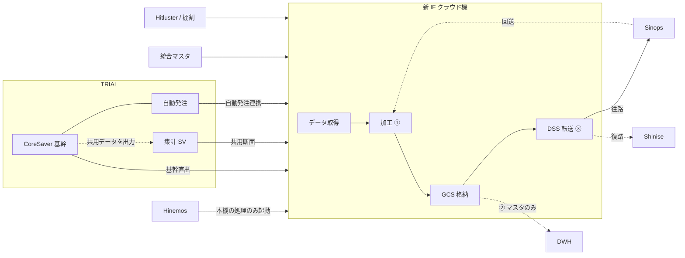

# SCM 統一 IF クラウド機アーキテクチャ（日本語版）

基準日: 2026-09-14  
対象: 西友 MD 基幹統合 / 自動補充 Sinops 系 第2段階  
位置づけ: 同日合意した中国語資料の対訳。詳細設計の Job 前提。DSS スクリプトそのものではない。

出典:

- `【概算見積もり】西友MD基幹統合_外部IF開発見積_BO系・自動補充Sinops系_20260903.xlsx`
- 既存 DSS: `dhub-dss-{dev|stg|pro}`、GCS `ods-seiyu-*`、フレームワーク `SEIYUCOM000X`

---

## 1. 結論

新 IF クラウド機は **SCM の統一データ連携面** である。Sinops 専用機ではない。

- **Hinemos** は本機上の処理だけを起動する。
- **加工**（型変換、コード表、ファイルレイアウト）は本機のみ。
- **DSS** は加工済みファイルの転送であり、第二の加工面ではない。
- 将来の **WMS（Hitluster）** と **棚割** も同一機・同一台帳・同一 GCS を使う。
- IF クラウド機を課題ごとに別構築すると、SCM 統一連携面が割れる。

第2段階の Sinops 見積は **403 人日**（詳細設計 136 + 開発 144 + 単体 123）。共通基盤 **43 人日** はハブ立上げであり、403 に按分しない。BO 系 53.5 人日のプログラムは本段階の対象外だが、**同一 IF 機は使う**。

---

## 2. 構成図

凡例:

- 実線 = 往路（Sinops へ）
- 破線 = 復路（Shinise へ）
- 点線 = Intake（マスタのみ DWH へ）

直結しないもの:

- 集計 SV / CoreSaver / 自動発注 → Sinops
- Sinops → Shinise

---

## 3. TRIAL 側の関係

| コンポーネント | 意味 | IF クラウド機への渡し方 |
|---|---|---|
| CoreSaver | TRIAL の **基幹データ** | 発注締め等は基幹直出（13/19 など） |
| 集計 SV | 基幹から出力する **各種共用データ** | 第二の基幹ではない。販売・来客・廃棄等の断面（06–09 など） |
| 自動発注 | 同じ基幹を使う TRIAL 側機能 | 仕入先休日等（18）。見積は TRIAL 自動発注連携前提 |

西友側の統合マスタ、Hitluster、棚割は TRIAL 枠の外。いずれもいったん本機へ落としてから DSS で送る。

---

## 4. 双方向経路

### 往路（Sinops 向け）

1. ソースから IF クラウド機へ取得（① 抽出）
2. 本機で加工し Sinops ファイルを生成（① 297 人日）
3. 必要なマスタのみ DWH へ Intake（② 31 人日。実績は多くが 0）
4. DSS が加工済みファイルを Sinops へ転送（③）

### 復路（Sinops 回送 → Shinise）

1. DSS が Sinops から回送ファイルを取得（③ 受信）
2. 本機で Shinise 取込用に加工（①）
3. DSS が Shinise へ転送（③ 送信）

見積 22–25 の「CORESAVER連携→SHINISE連携」は次のとおり整理する。

- CoreSaver = 往路の基幹
- 発注勧告の回送 = 復路で Shinise
- 便区分は Shinise 側前提（本見積 403 に含まない）

---

## 5. 見積三層との対応

| 層 | 範囲 | Sinops 人日 | 内容 |
|---|---|---|---|
| ① | ソース ↔ IF クラウド機で加工 | 297 | 往路：基幹直出 / 集計出力 / 自動発注 / 統合マスタ。復路：Sinops 回送を Shinise 向けに変換 |
| ② | IF クラウド機 → DWH | 31 | DSS Intake。原則ファイルをそのまま格納。対象は 01–05、13、14、16–19 |
| ③ | IF クラウド機 ↔ Sinops / Shinise | 75 | DSS 転送。往路は Sinops、復路は Shinise。14 は送受信 |

Layer① 見出しの「IF用サーバー構築、MD/SCM・BOの共通化、型変換」は、本機上の抽出プログラムであり、43 人日の外でもう一台買う意味ではない。

---

## 6. 共通基盤 43 人日

単位: 人日。単価 27,500 円（税抜）。見積シート「共通・PJ管理」。備考原文: BO系／Sinops系の双方で使用。

| 項目 | 設計 | 開発 | 単体 | 小計 |
|---|---|---|---|---|
| IF用サーバー DEV/STG/PROD 設計・立上げ・設定 | 5 | 15 | 0 | 20 |
| Hinemos ジョブ設定 | 5 | 5 | 3 | 13 |
| DataSpider 関連設定・教育 | 0 | 10 | 0 | 10 |
| **合計** | **10** | **30** | **3** | **43** |

43 はハブ立上げ費。Sinops 課題本体 403 に按分しない。BO・将来の WMS・棚割も同じ 1 回で済む。

IF クラウド機を別構築する場合、労働下限はもう +43。ライセンス、仮想マシン、第二の教育は見積外。Hinemos の起動先も二系統になる。

---

## 7. 第2段階の会計境界

| 塊 | 人日 | 扱い |
|---|---|---|
| 自動補充 Sinops 系 | 403 | 第2段階の課題本体（11,082,500 円） |
| 共通基盤 | 43 | SCM ハブ。Sinops 専用 446 と足し上げない |
| PJ 管理 | 50 | 横断。403 に入れない |
| BO 系 | 53.5 | 本段階では BO プログラムを作らない。同一 IF 機は使う |

工程は詳細設計・開発・単体テストのみ。結合・総合・移行・運用は含まない。Shinise の便区分開発、棚割ダミー、マスタ統合課題本体も本見積外。

---

## 8. 詳細設計への落とし方

- Job は「ソースは出数、本機で加工、DSS は転送」で書く。
- Hinemos の順序は 取得 → 加工 →（必要なら Intake）→ DSS 送信。往路・復路とも本機。
- IF ID は `SEIYU-TRIALインターフェース管理台帳` の DSS 台帳から採番。プロジェクト名 = IF ID。トリガは `SEIYUCOM000X`。
- GCS は `ods-seiyu-{dev|stg|prod}`、接続名 `GCP_STR_DSS`、ディレクトリは IF ID 配下。
- 詳細設計はサーバー待ちで止めない。開発・単体は DEV の DSS + GCS が必要。

未決（本資料では経路だけ固定）:

- 05 ケースバラ方針
- 13/19 の締め時刻・対象 FLG の最終ソース内訳
- 14/15 棚割開始日
- 22–25 の回送レイアウト確定
