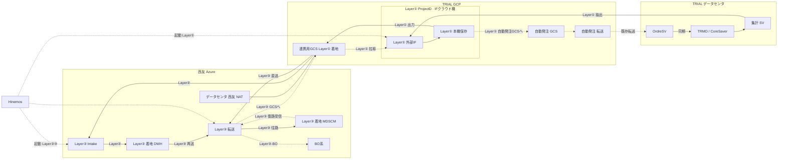

# SCM 統一 IF クラウド機アーキテクチャ（日本語版）

基準日: 2026-09-15  
対象: 西友 MD 基幹統合 / 自動補充 Sinops 系 第2段階  
位置づけ: 詳細設計の Job 前提。DSS スクリプトそのものではない。

出典:

- `【概算見積もり】西友MD基幹統合_外部IF開発見積_BO系・自動補充Sinops系_20260903.xlsx`
- 既存 DSS: 西友 Azure 上の DataSpider。GCS 連携用プロジェクト例 `seiyu-trial-data-exchange`
- `sources/20260915-データ連携経路-データ活用連携_小峰資料_松尾加筆.md`

---

## 1. 結論

申請する **IF クラウド機** は TRIAL GCP の **1 Project** である。作業名は **ProjectD（Seiyu_Order）**。中身は図の **外部IF** だけ（集計SV抽出、本機保存、GCS へファイル出力）。

- **GCS** は同じ TRIAL GCP の **連携用プロジェクト**（例 `seiyu-trial-data-exchange`、担当 末松）。クラウド機（ProjectD）ではない。
- **DataSpider** は **西友 Azure** にある。② Intake と ③ 転送。二次加工しない。ProjectD に入れない。
- 西友 DataSpider から GCS へは、西友データセンタ NAT ↔ TRIAL データセンタ NAT。スライド注記は西友起点。
- **Hinemos** は共通基盤。① は ProjectD、②③ は西友 DataSpider を起動する。
- IF クラウド機を課題ごとに別 Project にすると、SCM 統一連携面が割れる。

第2段階の Sinops 見積は **403 人日**（詳細設計 136 + 開発 144 + 単体 123）。共通基盤 **43 人日** はハブ立上げであり、403 に按分しない。BO 系 53.5 人日のプログラムは本段階の対象外だが、**同一の ProjectD + 西友 DataSpider は使う**。

---

## 2. 構成図

凡例（見積「前提条件・注記」準拠）:

- **Layer①** TRIAL↔GCS（外部IFプログラム開発）。**クラウド機 = TRIAL GCP ProjectD（Seiyu_Order）の外部IF**。297 人日。GCS は別連携用プロジェクト
- **Layer②** GCS→DWH（DataSpider 取込ジョブ）。**西友 Azure の DataSpider**。31 人日
- **Layer③** DWH・GCS↔業務システム（DataSpider 連携ジョブ）。**西友 Azure の DataSpider**。75 人日
- Hinemos は Layer ではない。①は ProjectD、②③は西友 DataSpider を起動する。

直結しないもの:

- 集計 SV / CoreSaver / 統合マスタ / 自動発注 → Sinops
- Sinops → Shinise
- Sinops → OrdreSV / CoreSaver
- 西友 DataSpider → OrdreSV（TRIAL と西友の唯一の交互通路は GCS）

---

## 3. TRIAL 側の関係

| コンポーネント | 意味 | IF クラウド機への渡し方 |
|---|---|---|
| CoreSaver | TRIAL **基幹データ**。発注勧告の同期先 | 往路：TRMD→集計SV。クラウド機は集計SVから抽出。復路：OrdreSV 自動確定後に同期で戻る |
| OrdreSV | **基幹の発注サーバ群**。TRIAL 自動発注サーバそのものではない | 復路着地。西友 DSS からは受け取らない。TRIAL 自動発注の転送機能経由で自動確定する |
| 統合マスタ | **基幹の一部**（西友×TRIAL 統合後のマスタ IF） | 商品・店舗商品・カテゴリ・仕入先等（01–05、16–17）。TRIAL 枠の外ではない |
| 集計 SV | 基幹から出力する **各種共用データ**。クラウド機の抽出元 | マスタ系は TRMD→集計SV→外部IF。第二の基幹ではない |
| 自動発注 | 同じ基幹を使う TRIAL 側機能。**自動発注 GCS + 転送**を持つ | 往路：仕入先休日等（18）。復路：IF クラウド機が勧告を自動発注 GCS へ置き、既存の転送機能が OrdreSV へ渡す |
| Shinise | TRIAL の **新基幹** | 発注勧告の着地ではない。便区分等は Shinise 側前提のまま |

棚割と倉庫（Hitluster）は **SEIYU 側の源ではない**。一覽の転送方向に従う。

- マスタ / 売上 / 在庫 / 棚割：**TRIAL→西友**、接続先は自動補充
- 棚割の接続元は **棚割→集計SV→外部IF→GCS**
- 倉庫系も **集計SV→外部IF→GCS**
- 発注勧告：**西友→TRIAL**。会社間は連携用 GCS のみ。着地は自動発注転送経由の基幹 OrdreSV

---

## 4. 双方向経路

### 往路（Sinops 向け）

1. TRMD 基幹は集計SVへ出す。IF クラウド機の外部IFが集計SVから抽出（①）
2. 外部IFで共通化・型変換し、**本機に保存**する（①）
3. ファイル出力で GCS 連携用ファイルへ置く。GCS はクラウド機ではない（① 297 人日）
4. 必要なマスタのみ DSS が DWH へ Intake（② 31 人日。実績は多くが 0）
5. DSS が GCS 上のファイルを Sinops へ転送（③）

### 復路（Sinops 発注勧告 → 連携用 GCS → IFクラウド機 → 自動発注 GCS → OrdreSV）

TRIAL と西友の **唯一の交互通路は GCS**。西友 DSS は OrdreSV へ直送しない。

1. DSS が Sinops から発注勧告を取得し、**連携用 GCS** へ置く（③ 受信・書込）
2. IF クラウド機が連携用 GCS から勧告を拉取し、TRIAL 自動発注 IF のレイアウトへ変換して本機保存（①）
3. IF クラウド機が変換後ファイルを **TRIAL 自動発注の GCS** へ置く（①）。連携用 GCS とは別用途
4. **TRIAL 自動発注の転送機能** が自動発注 GCS から OrdreSV へ渡す（既存機能。西友 DSS ではない。403 の③送信ではない）
5. OrdreSV が自動確定したあと、CoreSaver へ同期（基幹内。403 の IF 加工には入れない）

見積 22–25 の「CORESAVER連携→SHINISE連携」は次のとおり読む。

- 実経路の最終着地は OrdreSV。Shinise は TRIAL 新基幹だが、勧告のホップではない
- 会社間をまたぐのは **連携用 GCS のみ**。ファイル契約は TRIAL 自動発注 IF
- OrdreSV は自動発注サーバそのものではない。自動発注は GCS 受けと転送を担う
- 便区分は Shinise 側前提（本見積 403 に含まない）
- 自動発注の既存転送、OrdreSV の自動確定、CoreSaver 同期は TRIAL 内であり、403 に含まない
- 既存 OrderSV 対照（`EOBTempOrderData_XXXX`）は自動発注 IF のレイアウト参照

---

## 5. 見積三層との対応

出典: 見積シート「Sinops系明細」。単位は人日。

| 層 | 範囲 | 対象 IF | Sinops 人日 | 内容 |
|---|---|---|---|---|
| ① | TRIAL↔GCS（外部IFプログラム開発） | **01–25 全件**。10 は店舗/センターを 2 行 | 297 | ProjectD 外部IF。往路：集計SV抽出・共通化・本機保存・連携用 GCS 出力。復路 22–25：連携用 GCS から拉取し自動発注 IF へ変換、自動発注 GCS へ出力 |
| ② | GCS→DWH（DataSpider 取込） | **01–05、13、14、16–19** の 11 本のみ | 31 | 西友 Azure DataSpider。GCS ファイルをそのまま Intake。06–12、15、20–25 は 0 |
| ③ | DWH・GCS↔業務システム（連携） | **01–25 全件** | 75 | 西友 Azure DataSpider。往路は Sinops / sinops-W。14 は受信 GCS→Sinops と送信 DWH→GCS。22–25 は勧告受信して連携用 GCS へ書く。OrdreSV へは送らない |

### IF 別

| IF | 名称 | ① | ② | ③ | 計 | 経路 |
|---|---|---|---|---|---|---|
| 01 | 商品マスタ | 13 | 3 | 3 | 19 | ①→②→③ Sinops |
| 02 | 店舗商品マスタ | 13 | 3 | 3 | 19 | 同上 |
| 03 | カテゴリマスタ | 6 | 2.5 | 2.5 | 11 | 同上 |
| 04 | 仕入先マスタ | 3 | 2.5 | 2.5 | 8 | 同上 |
| 05 | ケースバラ変換マスタ | 14 | 2.5 | 2.5 | 19 | 同上 |
| 06 | 販売実績 | 10 | 0 | 3 | 13 | ①→③ 直送。不入湖 |
| 07 | 時間帯別販売数量 | 14 | 0 | 4 | 18 | 同上 |
| 08 | 来客数実績 | 3.5 | 0 | 2.5 | 6 | 同上 |
| 09 | 廃棄情報 | 5.5 | 0 | 2.5 | 8 | 同上 |
| 10 | 在庫修正 店+センター | 10+10 | 0 | 2.5 | 22.5 | ① は 2 行。③ は 1 行 |
| 11 | 入荷実績 | 10 | 0 | 2.5 | 12.5 | ①→③ 直送 |
| 12 | 入荷予定 | 10 | 0 | 2.5 | 12.5 | 同上 |
| 13 | 発注スケジュール | 14 | 2.5 | 2.5 | 19 | ①→②→③ |
| 14 | 棚割明細 | 20 | 3 | 6 | 29 | ③ に送受信。備考原文 |
| 15 | 新商品用在庫 | 20 | 0 | 3 | 23 | ① が DWH 棚割 × TRMD マスタで生成。② なし |
| 16 | 商品マスタ【倉庫】 | 14 | 4 | 4 | 22 | ①→②→③ sinops-W |
| 17 | 仕入先マスタ【倉庫】 | 3 | 2.5 | 2.5 | 8 | 同上 |
| 18 | 仕入先休日設定【倉庫】 | 12 | 2.5 | 2.5 | 17 | ① の源は TRIAL 自動発注連携 |
| 19 | 仕入先発注曜日【倉庫】 | 14 | 3 | 3 | 20 | ①→②→③ |
| 20 | 発注実績【倉庫】 | 8 | 0 | 2.5 | 10.5 | ①→③ 直送 |
| 21 | 受払明細【倉庫】 | 14 | 0 | 4 | 18 | 同上 |
| 22 | 発注勧告(当日)【倉庫】 | 14 | 0 | 3 | 17 | ③連携用GCSへ → ①拉取・変換 → 自動発注GCS → 既存転送 → OrdreSV |
| 23 | 発注勧告(翌日)【倉庫】 | 14 | 0 | 3 | 17 | 同上 |
| 24 | 発注勧告(当日) | 14 | 0 | 3 | 17 | 同上 |
| 25 | 発注勧告(翌日) | 14 | 0 | 3 | 17 | 同上 |

Layer① 見出しの「IF用サーバー構築、MD/SCM・BOの共通化、型変換」は、IF クラウド機上の抽出プログラムであり、43 人日の外でもう一台買う意味ではない。

---

## 6. 共通基盤 43 人日

単位: 人日。単価 27,500 円（税抜）。見積シート「共通・PJ管理」。備考原文: BO系／Sinops系の双方で使用。

| 項目 | 設計 | 開発 | 単体 | 小計 |
|---|---|---|---|---|
| IF用サーバー DEV/STG/PROD 設計・立上げ・設定 | 5 | 15 | 0 | 20 |
| Hinemos ジョブ設定 | 5 | 5 | 3 | 13 |
| DataSpider 関連設定・教育 | 0 | 10 | 0 | 10 |
| **合計** | **10** | **30** | **3** | **43** |

43 はハブ立上げ費。Sinops 課題本体 403 に按分しない。BO・将来の WMS・棚割も同じ 1 回で済む。

IF クラウド機を別構築する場合、労働下限はもう +43。ライセンス、仮想マシン、第二の教育は見積外。Hinemos の起動先も二系統になる。

---

## 7. 第2段階の会計境界

| 塊 | 人日 | 扱い |
|---|---|---|
| 自動補充 Sinops 系 | 403 | 第2段階の課題本体（11,082,500 円） |
| 共通基盤 | 43 | SCM ハブ。Sinops 専用 446 と足し上げない |
| PJ 管理 | 50 | 横断。403 に入れない |
| BO 系 | 53.5 | 本段階では BO プログラムを作らない。同一の IF クラウド機 + DSS は使う |

工程は詳細設計・開発・単体テストのみ。結合・総合・移行・運用は含まない。Shinise の便区分開発、棚割ダミー、マスタ統合課題本体も本見積外。

---

## 8. 詳細設計への落とし方

- Job は「集計SVは出数、ProjectD 外部IFで抽出・保存、連携用 GCS へファイル出力、西友 DataSpider は転送」で書く。
- Hinemos の順序は 抽出 → 本機保存 → GCS 出力（ProjectD①）→（必要なら西友 DS Intake②）→ 西友 DS 送信③。復路 22–25 は 西友 DS が連携用 GCS へ書く → ProjectD が拉取・変換して自動発注 GCS へ置く → 既存の自動発注転送。
- IF ID は `SEIYU-TRIALインターフェース管理台帳` の DSS 台帳から採番。プロジェクト名 = IF ID。トリガは `SEIYUCOM000X`。
- GCS は TRIAL GCP 連携用プロジェクト（例 `seiyu-trial-data-exchange`）。接続名と IF ID 配下ディレクトリは台帳確定後に書く。
- 詳細設計はサーバー待ちで止めない。開発・単体は DEV の DSS + GCS が必要。

未決（本資料では経路だけ固定）:

- 05 ケースバラ方針
- 13/19 の締め時刻・対象 FLG の最終ソース内訳
- 14/15 棚割開始日
- 22–25 の自動発注 IF レイアウト確定（着地は基幹 OrdreSV。経路は連携用 GCS → クラウド機 → 自動発注 GCS → 既存転送。当日/翌日、担当者コードは残）
- 自動発注 GCS の正式プロジェクト ID / バケット契約（連携用 GCS との切り分け）
